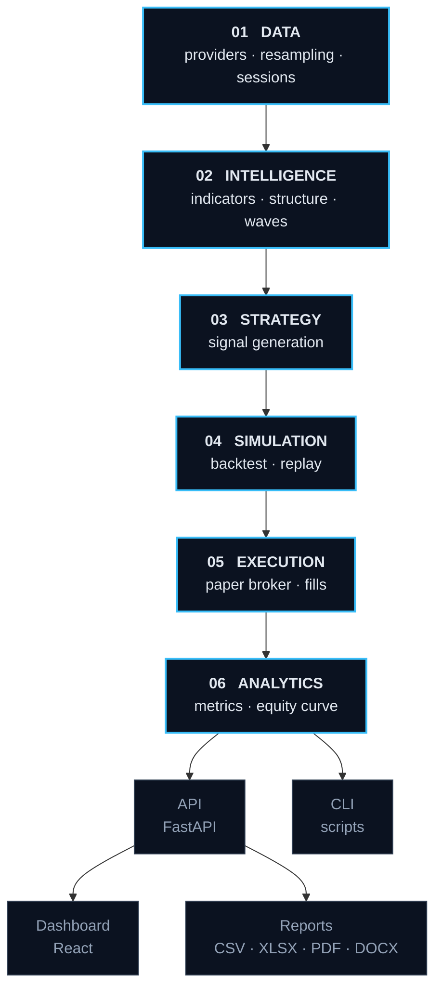
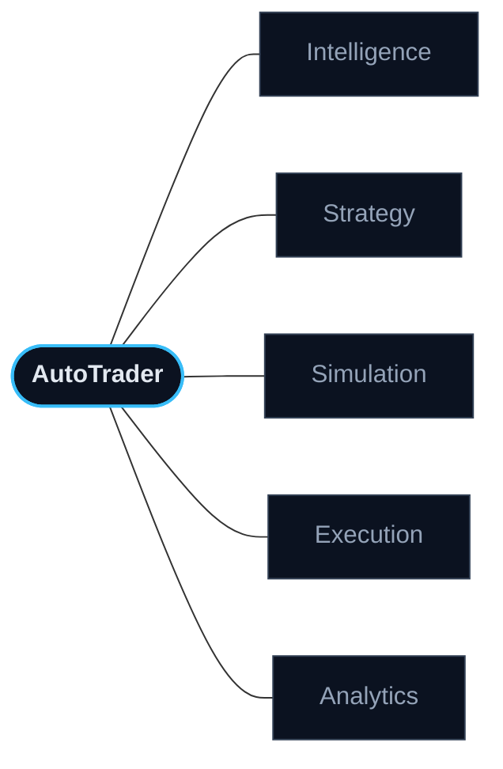
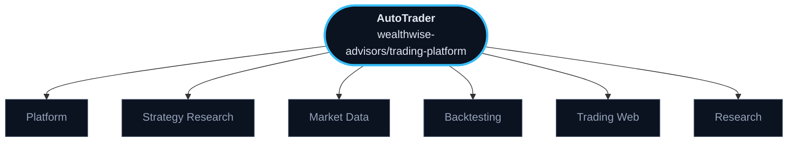
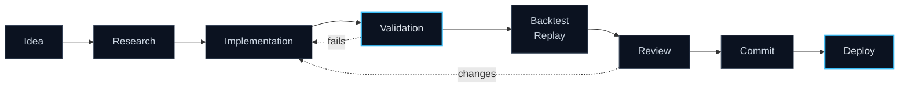

<div align="center">


<br>

**Algorithmic trading research, from raw market data to a scored result.**

[](../../actions/workflows/ci.yml) [](../../actions/workflows/deploy.yml) [](pyproject.toml) [](web) [](api) [](LICENSE)

</div>

<br>

---

## What is AutoTrader?

A research platform for building and testing futures trading strategies.
Market data goes in one end; a scored, reproducible result comes out the other,
and every stage in between can be opened and inspected.

<br>

<div align="center">

**Market Data** &nbsp;→&nbsp; **Intelligence** &nbsp;→&nbsp; **Strategy** &nbsp;→&nbsp; **Simulation** &nbsp;→&nbsp; **Execution** &nbsp;→&nbsp; **Analytics**

</div>

<br>

→ Multi-source market data, live and historical<br>
→ Technical and structural market analysis<br>
→ Multi-strategy research on one interface<br>
→ Backtesting and bar-by-bar replay<br>
→ Paper execution with realistic fills<br>
→ Web dashboard and exportable reports

<br>

---

## Core Architecture



<br>

`01` &nbsp; **Data** — fetch, resample and session-filter bars &nbsp;·&nbsp; [`src/data/`](src/data)

`02` &nbsp; **Intelligence** — indicators, structure, patterns, waves &nbsp;·&nbsp; [`src/analysis/`](src/analysis)

`03` &nbsp; **Strategy** — turn analysis into signals &nbsp;·&nbsp; [`src/strategies/`](src/strategies)

`04` &nbsp; **Simulation** — run signals over history or bar-by-bar &nbsp;·&nbsp; [`src/backtesting/`](src/backtesting)

`05` &nbsp; **Execution** — fills, slippage, commission &nbsp;·&nbsp; [`src/broker/`](src/broker)

`06` &nbsp; **Analytics** — score and present the result &nbsp;·&nbsp; [`api/report/`](api/report)

<br>

---

## Market Intelligence

**Technical Analysis** &nbsp;·&nbsp; [`indicators.py`](src/analysis/indicators.py)

→ RSI · Stochastic · EMA · ATR<br>
→ VWAP with deviation bands<br>
→ Volume Profile · POC · value area

<br>

**Market Structure** &nbsp;·&nbsp; [`swing_identification.py`](src/analysis/swing_identification.py) &nbsp;[`zigzag.py`](src/analysis/zigzag.py) &nbsp;[`regime.py`](src/analysis/regime.py)

→ Swing high / low detection<br>
→ ZigZag with deviation control<br>
→ Divergence between price and momentum<br>
→ Regime classification

<br>

**Pattern Intelligence** &nbsp;·&nbsp; [`candlestick_patterns.py`](src/analysis/candlestick_patterns.py) &nbsp;[`chart_patterns.py`](src/analysis/chart_patterns.py)

→ Candlestick formations<br>
→ Chart formations

<br>

**Elliott Wave** &nbsp;·&nbsp; [`src/analysis/elliott_wave/`](src/analysis/elliott_wave)

→ Impulse · diagonals · zigzag · flats · combinations<br>
→ Candidate generation and structural validation<br>
→ Fibonacci measurement between waves

```text
Market Data  →  Swing Structure  →  Wave Candidates  →  Validation  →  Result
```

<details>
<summary><b>Elliott Wave internals</b></summary>

<br>

Twelve modules behind [`pipeline.py`](src/analysis/elliott_wave/pipeline.py):

→ [`pivots.py`](src/analysis/elliott_wave/pivots.py) — pivot extraction<br>
→ [`impulse.py`](src/analysis/elliott_wave/impulse.py) · [`diagonal.py`](src/analysis/elliott_wave/diagonal.py) — motive structures<br>
→ [`correction.py`](src/analysis/elliott_wave/correction.py) · [`triangle.py`](src/analysis/elliott_wave/triangle.py) · [`combination.py`](src/analysis/elliott_wave/combination.py) — corrective structures<br>
→ [`validation.py`](src/analysis/elliott_wave/validation.py) — rule enforcement<br>
→ [`measurements.py`](src/analysis/elliott_wave/measurements.py) — Fibonacci relationships<br>
→ [`momentum.py`](src/analysis/elliott_wave/momentum.py) · [`hierarchy.py`](src/analysis/elliott_wave/hierarchy.py) — confirmation and degree nesting

Rules and open questions →
[Rules](docs/ELLIOTT_WAVE_RULES.md) ·
[SRS](docs/ELLIOTT_WAVE_SRS.md)

</details>

<br>

---

## Strategy Engine

Five strategy families &nbsp;·&nbsp; [`src/strategies/`](src/strategies)

→ [RSI Divergence](src/strategies/rsi_divergence.py)<br>
→ [MA Crossover](src/strategies/ma_crossover.py)<br>
→ [Breakout](src/strategies/breakout.py)<br>
→ [RSI Mean Reversion](src/strategies/rsi_mean_reversion.py)<br>
→ [Regime Adaptive](src/strategies/regime_adaptive.py)

All implement the same interface — [`base_strategy.py`](src/strategies/base_strategy.py) —
so any strategy runs through the same simulation, execution and scoring pipeline.

```text
BaseStrategy  →  on_bar()  →  Signal  →  Simulation  →  Analytics
```

<br>

---

## Backtesting & Execution

```text
Historical Data  →  Strategy  →  Signal  →  Backtest / Replay  →  Trade  →  Metrics
```

→ **Backtesting** — full-range simulation over history<br>
→ **Replay** — bar-by-bar playback over WebSocket, several timeframes on one clock<br>
→ **Paper broker** — market, limit and stop orders with slippage and commission<br>
→ **Metrics** — equity curve, drawdown, Sharpe, Sortino, profit factor, win rate

Live brokerage execution is not enabled. The Rithmic adapter and live loop are
experimental &nbsp;·&nbsp; [`src/broker/`](src/broker) &nbsp;[`src/live/`](src/live)

<br>

---

## Dashboard & Analytics

A React dashboard on a FastAPI backend. The API is usable on its own, and the
CLI bypasses both for scripted research &nbsp;·&nbsp; [`web/src/`](web/src)

→ Candlestick and Elliott Wave charts<br>
→ Equity curve · drawdown · P&L distribution<br>
→ Monthly returns · win/loss breakdown<br>
→ Trade log and pattern tables<br>
→ Live replay with a shared market clock

<br>

---

## API

```text
FastAPI  →  backtests · replay · data · optimize · schwab · meta
```

Routers [`api/routers/`](api/routers) &nbsp;·&nbsp;
schemas [`api/schemas/`](api/schemas) &nbsp;·&nbsp;
guide [API_GUIDE.md](docs/API_GUIDE.md)

Results export to `CSV` `XLSX` `PDF` `DOCX` &nbsp;·&nbsp; [`api/export/`](api/export)

<br>

---

## Technology Stack

**BACKEND** &nbsp; `Python 3.12` `FastAPI` `Uvicorn` `Pydantic`

**DATA** &nbsp; `pandas` `NumPy` `pandas-ta`

**FRONTEND** &nbsp; `React 19` `TypeScript` `Vite` `Tailwind` `shadcn/ui` `Radix` `Zustand` `TanStack Query`

**VISUALISATION** &nbsp; `Plotly` `Recharts`

**REPORTING** &nbsp; `openpyxl` `ReportLab` `python-docx`

**TESTING** &nbsp; `pytest` `Vitest` `Ruff` `mypy` `oxlint`

**DEVOPS** &nbsp; `Docker` `GitHub Actions` `AWS EC2`

<br>

---

## Project Map



### Project Structure

```text
trading-platform/
├── src/
│   ├── analysis/          market intelligence
│   │   └── elliott_wave/  wave detection and rules
│   ├── strategies/        trading strategies
│   ├── backtesting/       simulation and replay
│   ├── broker/            order handling and fills
│   ├── data/              providers and resampling
│   └── live/              live loop (experimental)
├── api/
│   ├── routers/           REST and WebSocket
│   ├── schemas/           request and response models
│   ├── report/            chart and report generation
│   └── export/            CSV · XLSX · PDF · DOCX
├── web/src/               React dashboard
├── tests/                 correctness suites
├── docs/                  architecture and research
├── scripts/               CLI entry points
├── config/                settings and credential templates
└── data/sample/           bundled market data
```

[analysis](src/analysis) &nbsp;·&nbsp;
[elliott_wave](src/analysis/elliott_wave) &nbsp;·&nbsp;
[strategies](src/strategies) &nbsp;·&nbsp;
[backtesting](src/backtesting) &nbsp;·&nbsp;
[broker](src/broker) &nbsp;·&nbsp;
[data](src/data) &nbsp;·&nbsp;
[live](src/live) &nbsp;·&nbsp;
[routers](api/routers) &nbsp;·&nbsp;
[schemas](api/schemas) &nbsp;·&nbsp;
[report](api/report) &nbsp;·&nbsp;
[export](api/export) &nbsp;·&nbsp;
[web](web/src) &nbsp;·&nbsp;
[tests](tests) &nbsp;·&nbsp;
[docs](docs) &nbsp;·&nbsp;
[scripts](scripts) &nbsp;·&nbsp;
[config](config) &nbsp;·&nbsp;
[sample data](data/sample)

<br>

---

## Repository Ecosystem



| Repository | Purpose | |
|---|---|---|
| **trading-platform** | Predecessor platform | [Open ↗](https://github.com/wealthwise-advisors/trading-platform) |
| **trading-strategy** | Divergence strategy research | [Open ↗](https://github.com/wealthwise-advisors/trading-strategy) |
| **data** | Historical market archive | [Open ↗](https://github.com/wealthwise-advisors/data) |
| **backtest** | Strategy validation runs | [Open ↗](https://github.com/wealthwise-advisors/backtest) |
| **trading-web** | Earlier web applications | [Open ↗](https://github.com/wealthwise-advisors/trading-web) |
| **Wealthwise** | Elliott Wave working scripts | [Open ↗](https://github.com/wealthwise-advisors/Wealthwise) |
| **Project_work** | Project resources | [Open ↗](https://github.com/wealthwise-advisors/Project_work) |

<br>

---

## Development Workflow



Two gates are enforced, not conventions: the correctness suites must pass
before a deploy reaches the server &nbsp;·&nbsp;
[ci.yml](.github/workflows/ci.yml) &nbsp;[deploy.yml](.github/workflows/deploy.yml)

<br>

---

## Documentation

→ [Architecture](docs/ARCHITECTURE.md) — how the system fits together<br>
→ [Developer guide](docs/DEVELOPER_GUIDE.md) — working in the codebase<br>
→ [API guide](docs/API_GUIDE.md) — endpoints and payloads<br>
→ [Elliott Wave](docs/ELLIOTT_WAVE_ARCHITECTURE.md) — engine design and rules<br>
→ [Installation](docs/INSTALLATION.md) · [Quickstart](docs/QUICKSTART.md) · [Configuration](docs/CONFIGURATION.md)<br>
→ [Release notes](docs/RELEASE_NOTES.md) · [Security audit](docs/SECURITY_AUDIT.md) · [FAQ](docs/FAQ.md)

<br>

---

## Current Development

**Active** &nbsp; Elliott Wave engine · strategy research · dashboard

**Improving** &nbsp; reference-platform parity · data portability

**Planned** &nbsp; tick-resolution data · execution integrations

<br>

---

## Disclaimer

AutoTrader is research and simulation software. It is **not investment advice**
and makes no representation about future performance.

Execution is **paper only** — no live capital path is enabled. Trading futures
carries substantial risk of loss.

<br>

---

## License

**Proprietary — All Rights Reserved.** Copyright © 2026 WealthWise Advisors.

This software is proprietary and confidential. Copying, modification,
distribution or use is prohibited without prior written consent.

Full terms → [LICENSE](LICENSE)

<br>

<div align="center">

<sub>Built at <b>WealthWise Advisors</b></sub>

</div>
