<div align="center">


<br><br>

### Market data goes in. A number you can defend comes out.

**AutoTrader** is a futures research platform: it reads the market, tests an idea
against it bar by bar, charges realistic costs for every fill, and follows the live
tape while it does. Built at **WealthWise Advisors**.

<br>

[](../../actions/workflows/ci.yml)
[](../../actions/workflows/deploy.yml)
[](#-testing--quality)
[](#-testing--quality)

[](pyproject.toml)
[](api)
[](web)
[](web/tsconfig.json)
[](web/vite.config.ts)
[](requirements.txt)
[](web/package.json)
[](Dockerfile)
[](.github/workflows/deploy.yml)
[](src/data/schwab_provider.py)
[](pyproject.toml)

[](LICENSE)

</div>

<br>

<div align="center">
</div>

<br>

---

## 👀 Quick Look

The analysis engine on real ES data — price with swing structure and EMAs, then
RSI(2), Stochastic and RSI(13) beneath it, all on one shared time axis. Entries,
exits and every labelled swing are drawn by the same code the backtest scored.

<div align="center">
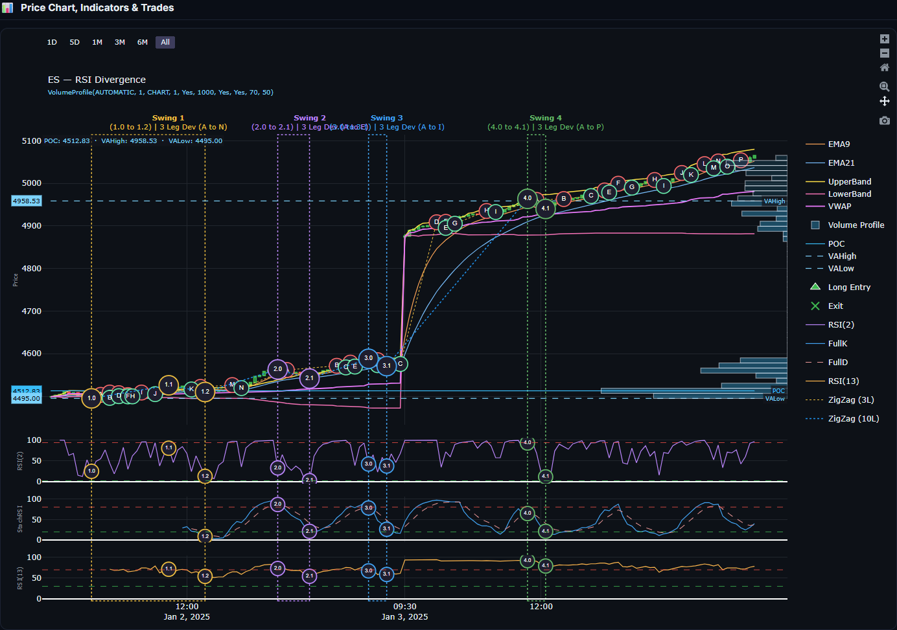
</div>

<br>

<div align="center">

| | | | |
|:---:|:---:|:---:|:---:|
| **1,864** | **77%** | **3.12** | **5** |
| tests passing | coverage | Python | strategies |

<sub>Verified by the runners, not typed from memory — see [Testing & Quality](#-testing--quality).</sub>

</div>

<br>

---

## 📑 Table of Contents

<table>
<tr><td valign="top" width="33%">

**◆ Understanding it**
- [Quick Look](#-quick-look)
- [About the Platform](#-about-the-platform)
- [Who This Is For](#-who-this-is-for)
- [Why It Exists](#-why-it-exists)
- [What Makes It Different](#-what-makes-it-different)
- [Highlights](#-highlights)
- [Live Replay](#-live-replay)

</td><td valign="top" width="33%">

**◆ How it works**
- [Architecture](#-architecture)
- [Project Workflow](#-project-workflow)
- [Market Intelligence](#-market-intelligence)
- [Strategy Engine](#-strategy-engine)
- [Backtesting & Execution](#-backtesting--execution)
- [Database](#-database)
- [Dashboard](#-dashboard)
- [Accounts & Access](#-accounts--access)
- [API Reference](#-api-reference)

</td><td valign="top" width="33%">

**◆ Working with it**
- [Technology Stack](#-technology-stack)
- [Folder Structure](#-folder-structure)
- [Getting Started](#-getting-started)
- [Testing & Quality](#-testing--quality)
- [Deployment](#-deployment)
- [Repository Ecosystem](#-repository-ecosystem)
- [Documentation](#-documentation)

</td></tr>
</table>

<br>

---

## 🎯 About the Platform

➜ Most trading tools tell you what to buy. This one tells you whether you
should have believed the last thing that told you what to buy.

➜ **AutoTrader** is an instrument for measuring trading ideas. You give it an
instrument, a date range and a strategy; it replays the market bar by bar,
executes the strategy against a broker that charges commission and slippage on
every fill, and hands back a result you can reproduce exactly.

<table>
<tr>
<td width="33%" valign="top">

 &nbsp;&nbsp;**Read the market**


**➜ Elliott Wave structure**

**➜ Swing pivots**

**➜ Chart and candlestick patterns**

**➜ VWAP with deviation bands**

**➜ Volume profile**

**➜ A regime classifier that says whether the market is trending, ranging or
volatile**

</td>
<td width="33%" valign="top">

 &nbsp;&nbsp;**Test the idea**


**➜ Bar-by-bar replay with a paper broker**

**➜ Commission per contract**

**➜ Slippage in ticks**

**➜ Prices rounded to the real increment — a plausible fill, not a closing
price**

</td>
<td width="33%" valign="top">

 &nbsp;&nbsp;**Trust the number**


**➜ 1,864 tests**

**➜ Deterministic runs**

**➜ One shared bar aggregator**

**➜ A deploy that refuses to succeed unless the server is actually running the
commit it claims**

</td>
</tr>
</table>

<br>

---

## 🧭 Who This Is For

<table>
<tr><td width="50%" valign="top">

**◆ If you trade and want to check an idea;**

<ol type="I">
<li><p>Start with the <a href="docs/QUICKSTART.md">Quickstart</a>.</p></li>
<li><p>Point it at synthetic data.</p></li>
<li><p>Run a strategy end to end without an account anywhere.</p></li>
<li><p>Then read <a href="#-backtesting--execution">Backtesting &amp; Execution</a> for what the fills actually cost you.</p></li>
</ol>

</td><td width="50%" valign="top">

**◆ If you build software and want to read the engine;**

<ol type="I">
<li><p>Start with <a href="src"><code>src/</code></a>.</p></li>
<li><p><a href="src"><code>src/</code></a> is the whole engine and imports nothing from <code>api/</code> or <code>web/</code>.</p></li>
<li><p>It runs from a test, a script or a server unchanged.</p></li>
<li><p><a href="docs/Design Document.md">Architecture</a> explains the seams.</p></li>
<li><p><a href="src/analysis"><code>src/analysis/</code></a> is where the market reading lives.</p></li>
</ol>

</td></tr>
</table>

> [!NOTE]
> **Three ways in,** depending on how much time you have;
>
> <ol type="I">
> <li><p>Five minutes: <a href="#-quick-look">Quick Look</a> and <a href="#-why-it-exists">Why It Exists</a>, the four bugs that shaped it.</p></li>
> <li><p>An hour: <a href="docs/QUICKSTART.md">Quickstart</a> and a real backtest.</p></li>
> <li><p>A day: <a href="docs"><code>docs/</code></a> carries the <a href="docs/PRD.md">product requirements</a>, the <a href="docs/Technical Requirements Document.md">requirements spec</a> and the <a href="docs/ELLIOTT_WAVE.md">Elliott Wave rule inventory</a>.</p></li>
> </ol>

<br>

---

## 💡 Why It Exists

**➜** A backtest is easy to write and very easy to fool yourself with. Four
specific ways, each one a real bug this codebase has hit and fixed, shape how the
platform is built:

<table>
<tr><td width="7%" align="center" valign="top">


</td><td valign="top">

**➜** **A bar that changes after you have seen it.** A bar polled mid-minute has a
high and a low that are still moving. Show it, and every number derived from it
is provisional without saying so.

**➜** Only closed bars ever reach the tape.

</td></tr>
<tr><td align="center" valign="top">


</td><td valign="top">

**➜** **Two code paths that disagree about a bar.** Aggregation was once duplicated
across three providers; the copy that forgot to anchor to the session kept
reintroducing shifted bars.

**➜** One aggregator, in [`src/data/resample.py`](src/data/resample.py).

</td></tr>
<tr><td align="center" valign="top">


</td><td valign="top">

**➜** **A number that moves when you touch a checkbox.** The same 30-minute bar
reported two different VWAPs depending on which other timeframes were selected.

**➜** Each bar carries its own volume-weighted price, built from the minutes inside
it.

</td></tr>
<tr><td align="center" valign="top">


</td><td valign="top">

**➜** **A deploy that quietly changes nothing.**

**➜** The pipeline asks the running server which commit it is serving and fails the
run unless it matches.

</td></tr>
</table>

<br>

---

## 🔀 What Makes It Different

Four claims a research tool can make, and what each one costs to actually mean.
Every row points at the code that enforces it, because a claim you cannot check
is a slogan.

<table>
<tr>
<td width="50%" valign="top">

 &nbsp;&nbsp;**A fill you can defend**


Orders fill at the *next* bar's open, plus slippage in ticks, rounded to the
instrument's real increment — never the signal bar's close

[](src/broker/paper_broker.py)

</td>
<td width="50%" valign="top">

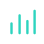 &nbsp;&nbsp;**One definition of a bar**


A single aggregator, session-anchored, shared by the historical and the live
path — so a 5m bar cannot mean two things

[](src/data/resample.py)

</td>
</tr>
<tr>
<td width="50%" valign="top">

 &nbsp;&nbsp;**A number that stays put**


A session grown bar by bar must come out byte-identical to one handed all the
data at once

[](tests)

</td>
<td width="50%" valign="top">

 &nbsp;&nbsp;**A deploy that cannot lie**


The pipeline asks the running server which commit it is serving and fails unless
it matches

[](.github/workflows/deploy.yml)

</td>
</tr>
</table>

> [!NOTE]
> None of these are hard to *say*. They are all annoying to *do*, which is why
> the four bugs above exist — every one of them is a case where the easy version
> was already shipped and quietly wrong.

<br>

---

## ✨ Highlights

<table>
<tr>
<td width="50%" valign="top">

### 📡 Follows the live market

<ol type="I">
<li><p>Load today, press Play, and the tape keeps up on its own.</p></li>
<li><p>New bars land within ~15 seconds of closing.</p></li>
<li><p>No reloading, no checkbox to remember.</p></li>
</ol>

</td>
<td width="50%" valign="top">

### 🌊 Elliott Wave engine

<ol type="I">
<li><p>Thirteen modules — impulses, corrections, diagonals, triangles, combinations.</p></li>
<li><p>Explicit rules a count must satisfy.</p></li>
<li><p>A hierarchy pass that nests degrees.</p></li>
</ol>

</td>
</tr>
<tr>
<td width="50%" valign="top">

### ⏱️ Eleven timeframes, one clock

<ol type="I">
<li><p>Panes advance off a shared market clock measured in market time, not in bars.</p></li>
<li><p>So a 1m pane and a 1h pane always show the same instant.</p></li>
</ol>

</td>
<td width="50%" valign="top">

### 📊 Broker-accurate VWAP

<ol type="I">
<li><p>Volume-weighted price per bar with σ bands at any level.</p></li>
<li><p>Colour-grouped by whole number so agreement across timeframes is visible at a glance.</p></li>
</ol>

</td>
</tr>
<tr>
<td width="50%" valign="top">

### 💰 Costs that are actually charged

<ol type="I">
<li><p>Commission per contract.</p></li>
<li><p>Slippage in ticks.</p></li>
<li><p>Tick-size rounding.</p></li>
<li><p>Per-instrument contract specifications so P&amp;L lands in real currency.</p></li>
</ol>

</td>
<td width="50%" valign="top">

### 📤 Exports that match the screen

<ol type="I">
<li><p>CSV.</p></li>
<li><p>XLSX.</p></li>
<li><p>PDF.</p></li>
<li><p>DOCX.</p></li>
<li><p>With charts rendered server-side from the same data the dashboard drew.</p></li>
</ol>

</td>
</tr>
</table>

<br>

---

## 📡 Live Replay

<div align="center">
</div>

<br>

- ➜ **The flagship surface** — loads history, plays it bar by bar, then keeps going
- ➜ **Follows the live market** — instead of stopping at the snapshot it loaded
- ➜ **The forming bar is withheld** — the tape advances only on a bar that has closed

**What makes it trustworthy rather than merely live**

| Rule | Why |
|---|---|
| **Only closed bars** | A bar polled mid-minute is still moving. Showing it puts a number on screen that changes afterwards — so it waits for the close |
| **Never silent** | The status line always states what is happening: `1 new bar, now at 15:56` · `the newest bar is still forming` · `could not reach the data source`. A quiet screen during an outage looks exactly like a calm market |
| **A pause is respected** | Following keeps the tape at the live edge; it does not drag you back from a bar you paused to study |
| **The gap is named** | *"1 min behind the clock — the current bar is still forming."* And when the gap exceeds what the design accounts for, it says the feed may be delayed instead of reassuring you |

> [!NOTE]
> **Why it looks one bar behind a broker platform.** thinkorswim draws the bar
> *currently forming*; this app draws the last bar that **closed**. Same instant,
> different bar. That is a difference in what is displayed, not a delay — and
> measured against the live feed, a closed bar reaches the tape in **5–16 seconds**.

<br>

---

## 🏗 Architecture

<div align="center">
</div>

- ➜ **The engine knows nothing about how it is called** — no HTTP, no React, no framework inside [`src/`](src)
- ➜ **Same answer from anywhere** — a test, the API and a script all run the identical analysis

<table>
<tr><td valign="top" width="33%">

**Key points**

- Engine is file/transport agnostic
- Single analysis path for all sources
- Deterministic replay with shared clock

</td><td valign="top" width="33%">

**Data flow**

- Sources → Core Engine → Interfaces
- Replay Engine feeds back into Strategies
- Same answer every time

</td><td valign="top" width="33%">

**Design principles**

- One shared aggregator (Resampler)
- Event-driven, modular components
- No HTTP, no React, no framework inside `src/`

</td></tr>
</table>

<br>

---

## 🔄 Project Workflow

How a change actually travels from an idea to the live URL.

<div align="center">
</div>

<table>
<tr><th width="20%" align="left">Stage</th><th align="left">What has to be true to move on</th></tr>
<tr><td><b>Research</b></td><td>The problem is <i>measured</i>, not assumed. A reported "2-minute lag" was sampled nine times against the live feed before a line of code changed — which showed the provider was not the cause</td></tr>
<tr><td><b>Implement</b></td><td>A test exists that <b>fails against the previous commit</b>. A test that passes either way defends nothing</td></tr>
<tr><td><b>Verify</b></td><td>1,864 tests, <code>ruff</code>, and <code>npm run build</code> — <i>not</i> <code>tsc --noEmit</code>, which reports success on broken JSX</td></tr>
<tr><td><b>Deploy</b></td><td>The running server is asked which commit it serves. Mismatch fails the run</td></tr>
</table>

<br>

---

## 🔍 Market Intelligence

<div align="center">
</div>

<br>

<table>
<tr><td valign="top" width="50%">

### 🌊 Elliott Wave
[`src/analysis/elliott_wave/`](src/analysis/elliott_wave)

- ➜ [`impulse`](src/analysis/elliott_wave/impulse.py) · [`correction`](src/analysis/elliott_wave/correction.py) · [`diagonal`](src/analysis/elliott_wave/diagonal.py)
- ➜ [`triangle`](src/analysis/elliott_wave/triangle.py) · [`combination`](src/analysis/elliott_wave/combination.py)
- ➜ [`pivots`](src/analysis/elliott_wave/pivots.py) — swing detection feeding the search
- ➜ [`hierarchy`](src/analysis/elliott_wave/hierarchy.py) — nesting wave degrees
- ➜ [`validation`](src/analysis/elliott_wave/validation.py) — **the rules a count must satisfy**
- ➜ [`measurements`](src/analysis/elliott_wave/measurements.py) · [`momentum`](src/analysis/elliott_wave/momentum.py)
- ➜ [`pipeline`](src/analysis/elliott_wave/pipeline.py) — the pass that ties it together

</td><td valign="top" width="50%">

### 📐 Price structure
[`src/analysis/`](src/analysis)

- ➜ [`swing_identification`](src/analysis/swing_identification.py) · [`zigzag`](src/analysis/zigzag.py) — the skeleton of a trend
- ➜ [`chart_patterns`](src/analysis/chart_patterns.py) — triangles, wedges, head-and-shoulders
- ➜ [`candlestick_patterns`](src/analysis/candlestick_patterns.py) — single and multi-bar formations
- ➜ [`indicators`](src/analysis/indicators.py) — RSI, Stochastic, moving averages, VWAP
- ➜ [`regime`](src/analysis/regime.py) — trending, ranging or volatile

</td></tr>
</table>

> [!IMPORTANT]
> **`validation` is the module that matters most.** Without it, a pattern search finds
> a "wave count" in any random walk you hand it.

**VWAP the way a broker platform computes it.** Each bar carries its own
volume-weighted price, built from the minutes inside it, rather than `(H+L+C)/3`.
Measured on the same closed 30-minute bar:

| Selection | Source | VWAP |
|---|---|---|
| 30m alone | 30m | 7810.2336 |
| 1m + 30m | 1m | **7809.9279** ← matches the reference platform |

Same bar, two answers, decided by a checkbox — which is exactly the class of
non-determinism the shared aggregator exists to kill.

<br>

---

## 🧠 Strategy Engine

- ➜ **Five strategies ship**, all behind one interface — [`base_strategy.py`](src/strategies/base_strategy.py)
- ➜ **Any of them drops into any run** — the engine never knows which it holds

| | Strategy | The idea |
|---|---|---|
| 🔀 | [**`rsi_divergence`**](src/strategies/rsi_divergence.py) | Price makes a new extreme, RSI does not — momentum failing to confirm |
| ↩️ | [**`rsi_mean_reversion`**](src/strategies/rsi_mean_reversion.py) | Fade an exhausted move back toward the mean |
| 📈 | [**`ma_crossover`**](src/strategies/ma_crossover.py) | Fast and slow moving averages crossing |
| 🚀 | [**`breakout`**](src/strategies/breakout.py) | Range resolution on expanding volume |
| 🎛️ | [**`regime_adaptive`**](src/strategies/regime_adaptive.py) | Switches behaviour on the [regime classifier's](src/analysis/regime.py) reading |

<div align="center">
</div>

<br>

> **Each timeframe gets its own strategy instance and its own paper broker.**
>
> - ➜ **The trigger is the divergence bar's high** — a later *close* above it is the entry
> - ➜ **The divergence only ARMS the setup** — several bars can pass before the trigger is taken
> - ➜ **Strategies are stateful** — a setup armed on one bar is confirmed several bars later
> - ➜ **So one shared instance would corrupt them** — an hourly bar would overwrite the one-minute strategy's pre-conditions and silently change its signals

<br>

---

## ⚙️ Backtesting & Execution

<div align="center">
</div>

- ➜ **Fills are charged, not assumed** — commission per contract, slippage in ticks, prices rounded to the instrument's real increment
- ➜ **Contract specifications per instrument** — tick size, tick value and point value for ES, NQ, MES, CL and others, so P&L lands in real currency
- ➜ **Session-aware** — RTH, Globex (18:00–17:00) or 24-hour, with VWAP anchored to the session open rather than to midnight
- ➜ **Deterministic** — the same inputs produce the same output every time, which is what makes a rebuilt result comparable to the one it replaced

### ◆ One clock, eleven timeframes

**➜** `step()` advances one **bar** — and a bar is a different span on every timeframe

**➜** Stepping N engines per tick desynchronises them: after 100 ticks a 1m pane has moved 100 minutes, a 1h pane 100 hours

**➜** So the clock runs in **market time** — one tick advances exactly one base bar

**➜** Every other timeframe steps only when its own bar has **closed**

**➜** Every lane reaches the right edge **together** — that is what *synchronised* means here

**➜** [`multi_replay.py`](src/backtesting/multi_replay.py)

<br>

<div align="center">
</div>

<br>

---

## 🗄️ Database

**SQLite** — one file, no server, no port, no password, no monthly bill.

<table>
<tr><td width="50%" valign="top">

**◆ In SQL**

**➜** Every scalar metric

**➜** One row per trade

**➜** 6 indexes — symbol, date, Sharpe, strategy

**➜** Trades cascade on delete

</td><td width="50%" valign="top">

**◆ Beside it, as Parquet**

**➜** Equity curve

**➜** OHLCV frame

**➜** dtypes and `DatetimeIndex` preserved

**➜** Row counts recorded, so truncation shows

</td></tr>
</table>

| | |
|:---|:---|
| **File** | `data/autotrader.db` — survives restarts and redeploys |
| **Schema** | [`db/schema.sql`](db/schema.sql) — `backtests`, `trades` |
| **Code** | [`db/`](db/README.md) — routers never see a cursor |
| **Guard** | A test fails the build if a metric has no column |

Query across runs:

```python
store.summaries(symbol="ES", min_sharpe=1.5, since="2026-03-01")
```

> [!NOTE]
> Writes fail soft — a locked file logs and serves from cache. If results stop
> surviving restarts, grep for `could not persist backtest`.

<br>

---

## 📊 Dashboard

A React 19 single-page application over the FastAPI backend.

| Page | What it does |
|---|---|
| ⚡ [**Live Replay**](web/src/features/replay) | Multi-timeframe grid, consolidated tape, playback controls, live following |
| 📉 [**Backtest**](web/src/features/backtest) | Configure, run and read a scored result |
| 📤 [**Export Data**](web/src/features/export) | Pull bars out for use elsewhere |

- ➜ **Charts** — candles with VWAP, deviation bands, volume profile and wave overlays
- ➜ **Deviation colouring** — band values grouped by whole number, with disjoint palettes for upper and lower so the two can never be confused
- ➜ **Logic lives in [`web/src/lib`](web/src/lib)** — 270 of the suite's 296 tests run without a browser

<br>

---

## 🔐 Accounts & Access

Open registration. Four ways in, or a password.

<table>
<tr><td width="50%" valign="top">

**◆ Ways to sign in**
- **Google** — one click, address already verified
- **GitHub** — one click, verified address read from `/user/emails`
- **LinkedIn** — one click, OpenID Connect
- **Twitter / X** — asks for an address on first use, then one click
- **Username + password** — argon2id, 12 characters minimum

</td><td width="50%" valign="top">

**◆ Getting back in**
- **Forgot password** — single-use link, expires in 1 hour
- **Forgot username** — emailed to the address on the account
- Completing a reset **revokes every existing session**
- Both refuse to say whether an address has an account

</td></tr>
</table>

<details>
<summary><b>What an account does not grant</b> — the broker stays out of reach</summary>
<br>

There is exactly one Schwab connection: one `config/credentials.yaml`, one
`schwab_tokens.json`, no per-user notion anywhere in `schwab_provider.py`. It is
the operator's own brokerage authorisation, not the application's.

So it is **not** a permission an account can earn — not by registering, and not
by verifying an email, because verifying an inbox says nothing about whether
someone should reach somebody else's broker.

| Control | Effect |
|---|---|
| `users.is_owner` defaults to `0` | Every account created by any route starts without it |
| No parameter on `create_user` | No argument any endpoint could pass to grant it |
| Set only by `manage_users.py` | Requires shell access on the server |

</details>

<details>
<summary><b>Per-user isolation</b> — schema v4, and why the cache mattered too</summary>
<br>

`backtests` and `trades` carry a `user_id`. Every read, write and delete filters
on it, and no repository function takes a default — a forgotten argument is a
`TypeError`, not a leak.

Scoping the SQL alone was not enough. `api/store.py` held an in-memory cache
keyed by `backtest_id`, and a cache hit returns **before any query runs** — so a
second user asking for a cached id would have been handed the first user's
result without SQLite being consulted. The key is `(user_id, backtest_id)`.

Another user's backtest is **404, not 403**. A 403 confirms the id exists, which
turns every result endpoint into an oracle for enumerating other people's runs.

</details>

<details>
<summary><b>Abuse controls</b> — CAPTCHA, rate limits, verified addresses</summary>
<br>

| Control | Where |
|---|---|
| Cloudflare Turnstile | Registration, forgot-password, forgot-username |
| Per-IP signup budget | Registration and both recovery endpoints |
| Per-`(ip, username)` throttle | Password login |
| argon2id | Every stored password |
| SHA-256 hashed tokens | Sessions, verification links, reset links |

**Turnstile fails closed.** Once a key is configured, a token that cannot be
checked — Cloudflare unreachable, timeout, malformed reply — is a refusal. A
verifier that waves people through on a network hiccup is one outage away from
being no verifier, and an attacker can cause that outage.

**Only a provider-verified address matches an account.** An unverified address
is a claim by whoever is signing in; honouring it would let someone assert
another person's email and be handed the account that owns it.

</details>

<details>
<summary><b>Dormant until configured</b> — nothing breaks without credentials</summary>
<br>

Every integration treats "no key" as a supported state rather than an error.

| Environment variable | Unset behaviour |
|---|---|
| `AUTOTRADER_{GOOGLE,LINKEDIN,GITHUB,TWITTER}_CLIENT_ID` / `_SECRET` | That provider reports itself unconfigured and its button says so |
| `AUTOTRADER_TURNSTILE_SITE_KEY` / `_SECRET_KEY` | The CAPTCHA slot collapses; registration still works |
| `AUTOTRADER_RESEND_API_KEY`, `AUTOTRADER_MAIL_FROM` | Verification and reset emails are logged as dormant, never faked |

The deploy prints `present:` / `ABSENT :` per integration — by presence only,
never a value or a length.

</details>

<br>

---

## 🔌 API Reference

FastAPI, with interactive documentation at **`/docs`** while running.

<details>
<summary><b>Every endpoint</b> — area, method, path and what it is for</summary>
<br>

| Area | Method | Endpoint | Purpose |
|---|---|---|---|
| Replay | `POST` | `/api/replay` | Create a session |
| Replay | `WS` | `/api/replay/ws/{id}` | Drive it bar by bar |
| Replay | `WS` | `↳ action: extend` | Pull bars that printed since |
| Backtest | `POST` | `/api/backtests` | Run and score a strategy |
| Market | `GET` | `/api/symbols` | Instruments and their specs |
| Market | `GET` | `/api/strategies` | Available strategies and parameters |
| Schwab | `GET` | `/api/schwab/status` | Auth state and token life |
| Export | `GET` | `/api/export/...` | CSV · XLSX · PDF · DOCX |
| Auth | `POST` | `/api/auth/register` | Create an account |
| Auth | `POST` | `/api/auth/login` · `/logout` | Start and end a session |
| Auth | `GET` | `/api/auth/me` | Who the caller is |
| Auth | `POST` | `/api/auth/forgot-password` · `/reset-password` | Recover by email |
| Auth | `POST` | `/api/auth/forgot-username` | Email the account name |
| Auth | `GET` | `/api/auth/verify-email` | Spend a confirmation link |
| OAuth | `GET` | `/api/auth/oauth/providers` | Which providers are configured |
| OAuth | `GET` | `/api/auth/oauth/{name}/start` · `/callback` | Google · LinkedIn · GitHub · X |
| OAuth | `POST` | `/api/auth/oauth/complete` | Finish an X sign-up |
| Meta | `GET` | `/api/version` | Build commit — used by the deploy assertion |

</details>

See [`api/routers/`](api/routers) and the [API Guide](docs/API_GUIDE.md).

<br>

---

## 🛠 Technology Stack

<details>
<summary><b>Backend, frontend and infrastructure</b> — every dependency that shows on screen</summary>
<br>

<table>
<tr><td valign="top" width="33%">

### ⚙️ Backend


</td><td valign="top" width="33%">

### 🖥 Frontend


</td><td valign="top" width="33%">

### ☁️ Infrastructure


</td></tr>
</table>

</details>

<br>

---

## 📂 Folder Structure

> [!TIP]
> **Every name below is a link.** Click a folder to open it, or a file to read
> it. Each directory also carries its own README explaining what it holds and why.

<details>
<summary><b>Full directory tree</b> — every file and folder, each name a link</summary>
<br>

<pre>
<a href=".">trading-platform</a>
|------------▶  <a href="src">src/</a>   <i>the engine — no HTTP, no React, no framework</i>  <b>61</b>
|               |------------▶  <a href="src/analysis">analysis/</a>   <i>reading the market</i>  <b>22</b>
|               |               |- - - ▶  <a href="src/analysis/candlestick_patterns.py">candlestick_patterns.py</a>
|               |               |- - - ▶  <a href="src/analysis/chart_patterns.py">chart_patterns.py</a>
|               |               |- - - ▶  <a href="src/analysis/indicators.py">indicators.py</a>
|               |               |- - - ▶  <a href="src/analysis/regime.py">regime.py</a>
|               |               |- - - ▶  <a href="src/analysis/swing_identification.py">swing_identification.py</a>
|               |               └- - - ▶  <a href="src/analysis/zigzag.py">zigzag.py</a>
|
|               |               └------------▶  <a href="src/analysis/elliott_wave">elliott_wave/</a>   <i>wave detection, rules and hierarchy</i>  <b>14</b>
|               |                               |- - - ▶  <a href="src/analysis/elliott_wave/combination.py">combination.py</a>
|               |                               |- - - ▶  <a href="src/analysis/elliott_wave/correction.py">correction.py</a>
|               |                               |- - - ▶  <a href="src/analysis/elliott_wave/diagonal.py">diagonal.py</a>
|               |                               |- - - ▶  <a href="src/analysis/elliott_wave/hierarchy.py">hierarchy.py</a>
|               |                               |- - - ▶  <a href="src/analysis/elliott_wave/impulse.py">impulse.py</a>
|               |                               |- - - ▶  <a href="src/analysis/elliott_wave/measurements.py">measurements.py</a>
|               |                               |- - - ▶  <a href="src/analysis/elliott_wave/models.py">models.py</a>
|               |                               |- - - ▶  <a href="src/analysis/elliott_wave/momentum.py">momentum.py</a>
|               |                               |- - - ▶  <a href="src/analysis/elliott_wave/pipeline.py">pipeline.py</a>
|               |                               |- - - ▶  <a href="src/analysis/elliott_wave/pivots.py">pivots.py</a>
|               |                               |- - - ▶  <a href="src/analysis/elliott_wave/triangle.py">triangle.py</a>
|               |                               └- - - ▶  <a href="src/analysis/elliott_wave/validation.py">validation.py</a>
|
|               |------------▶  <a href="src/strategies">strategies/</a>   <i>turning a reading into a decision</i>  <b>8</b>
|               |               |- - - ▶  <a href="src/strategies/base_strategy.py">base_strategy.py</a>
|               |               |- - - ▶  <a href="src/strategies/breakout.py">breakout.py</a>
|               |               |- - - ▶  <a href="src/strategies/ma_crossover.py">ma_crossover.py</a>
|               |               |- - - ▶  <a href="src/strategies/regime_adaptive.py">regime_adaptive.py</a>
|               |               |- - - ▶  <a href="src/strategies/rsi_divergence.py">rsi_divergence.py</a>
|               |               └- - - ▶  <a href="src/strategies/rsi_mean_reversion.py">rsi_mean_reversion.py</a>
|
|               |------------▶  <a href="src/backtesting">backtesting/</a>   <i>replay engine and the shared market clock</i>  <b>8</b>
|               |               |- - - ▶  <a href="src/backtesting/engine.py">engine.py</a>
|               |               |- - - ▶  <a href="src/backtesting/metrics.py">metrics.py</a>
|               |               |- - - ▶  <a href="src/backtesting/multi_replay.py">multi_replay.py</a>
|               |               |- - - ▶  <a href="src/backtesting/replay_engine.py">replay_engine.py</a>
|               |               |- - - ▶  <a href="src/backtesting/results.py">results.py</a>
|               |               └- - - ▶  <a href="src/backtesting/trade_quality.py">trade_quality.py</a>
|
|               |------------▶  <a href="src/broker">broker/</a>   <i>what a fill actually costs</i>  <b>5</b>
|               |               |- - - ▶  <a href="src/broker/base_broker.py">base_broker.py</a>
|               |               |- - - ▶  <a href="src/broker/paper_broker.py">paper_broker.py</a>
|               |               └- - - ▶  <a href="src/broker/rithmic_broker.py">rithmic_broker.py</a>
|
|               |------------▶  <a href="src/data">data/</a>   <i>providers, and one shared resampler</i>  <b>12</b>
|               |               |- - - ▶  <a href="src/data/base_provider.py">base_provider.py</a>
|               |               |- - - ▶  <a href="src/data/csv_provider.py">csv_provider.py</a>
|               |               |- - - ▶  <a href="src/data/external_csv_provider.py">external_csv_provider.py</a>
|               |               |- - - ▶  <a href="src/data/resample.py">resample.py</a>
|               |               |- - - ▶  <a href="src/data/rithmic_provider.py">rithmic_provider.py</a>
|               |               |- - - ▶  <a href="src/data/sample_data.py">sample_data.py</a>
|               |               └- - - ▶  <a href="src/data/schwab_provider.py">schwab_provider.py</a>
|
|               └------------▶  <a href="src/live">live/</a>   <i>live loop (experimental)</i>  <b>3</b>
|                               └- - - ▶  <a href="src/live/trader.py">trader.py</a>
|------------▶  <a href="api">api/</a>   <i>the FastAPI service</i>  <b>32</b>
|               |------------▶  <a href="api/routers">routers/</a>   <i>REST endpoints and the replay socket</i>  <b>8</b>
|               |               |- - - ▶  <a href="api/routers/backtests.py">backtests.py</a>
|               |               |- - - ▶  <a href="api/routers/data_export.py">data_export.py</a>
|               |               |- - - ▶  <a href="api/routers/meta.py">meta.py</a>
|               |               |- - - ▶  <a href="api/routers/optimize.py">optimize.py</a>
|               |               |- - - ▶  <a href="api/routers/replay.py">replay.py</a>
|               |               └- - - ▶  <a href="api/routers/schwab.py">schwab.py</a>
|
|               |------------▶  <a href="api/schemas">schemas/</a>   <i>request and response models</i>  <b>7</b>
|               |               |- - - ▶  <a href="api/schemas/backtest.py">backtest.py</a>
|               |               |- - - ▶  <a href="api/schemas/elliott_wave.py">elliott_wave.py</a>
|               |               |- - - ▶  <a href="api/schemas/optimize.py">optimize.py</a>
|               |               |- - - ▶  <a href="api/schemas/replay.py">replay.py</a>
|               |               └- - - ▶  <a href="api/schemas/schwab.py">schwab.py</a>
|
|               |------------▶  <a href="api/report">report/</a>   <i>charts rendered on the server</i>  <b>4</b>
|               |               |- - - ▶  <a href="api/report/charts.py">charts.py</a>
|               |               └- - - ▶  <a href="api/report/report.py">report.py</a>
|
|               └------------▶  <a href="api/export">export/</a>   <i>CSV · XLSX · PDF · DOCX</i>  <b>4</b>
|                               |- - - ▶  <a href="api/export/formats.py">formats.py</a>
|                               └- - - ▶  <a href="api/export/report_export.py">report_export.py</a>
|------------▶  <a href="web">web/</a>   <i>the React dashboard</i>  <b>92</b>
|               |------------▶  <a href="web/src/features">features/</a>   <i>replay, backtest and export pages</i>  <b>5</b>
|
|               |------------▶  <a href="web/src/components">components/</a>   <i>shared UI</i>  <b>34</b>
|
|               └------------▶  <a href="web/src/lib">lib/</a>   <i>pure logic, unit-tested away from React</i>  <b>31</b>
|                               |- - - ▶  <a href="web/src/lib/api.ts">api.ts</a>
|                               |- - - ▶  <a href="web/src/lib/bandAgreement.test.ts">bandAgreement.test.ts</a>
|                               |- - - ▶  <a href="web/src/lib/bandAgreement.ts">bandAgreement.ts</a>
|                               |- - - ▶  <a href="web/src/lib/chartAxis.test.ts">chartAxis.test.ts</a>
|                               |- - - ▶  <a href="web/src/lib/clock.test.ts">clock.test.ts</a>
|                               |- - - ▶  <a href="web/src/lib/clock.ts">clock.ts</a>
|                               |- - - ▶  <a href="web/src/lib/dayRange.test.ts">dayRange.test.ts</a>
|                               |- - - ▶  <a href="web/src/lib/dayRange.ts">dayRange.ts</a>
|                               └- - - ▶  <i>+22 more</i>
|------------▶  <a href="tests">tests/</a>   <i>what every number on screen rests on</i>  <b>26</b>
|               |- - - ▶  <a href="tests/test_api_provider_errors.py">test_api_provider_errors.py</a>
|               |- - - ▶  <a href="tests/test_engine.py">test_engine.py</a>
|               |- - - ▶  <a href="tests/test_follow_live_matrix.py">test_follow_live_matrix.py</a>
|               |- - - ▶  <a href="tests/test_indicator_correctness.py">test_indicator_correctness.py</a>
|               |- - - ▶  <a href="tests/test_multi_replay.py">test_multi_replay.py</a>
|               |- - - ▶  <a href="tests/test_provider_timeframes.py">test_provider_timeframes.py</a>
|               └- - - ▶  <i>+7 more</i>
|------------▶  <a href="docs">docs/</a>   <i>architecture, rules and guides</i>  <b>22</b>
|               |- - - ▶  <a href="docs/API_GUIDE.md">API_GUIDE.md</a>
|               |- - - ▶  <a href="docs/Design Document.md">Design Document.md</a>
|               |- - - ▶  <a href="docs/CONFIGURATION.md">CONFIGURATION.md</a>
|               |- - - ▶  <a href="docs/DEVELOPER_GUIDE.md">DEVELOPER_GUIDE.md</a>
|               |- - - ▶  <a href="docs/ELLIOTT_WAVE.md">ELLIOTT_WAVE.md</a>
|               |- - - ▶  <a href="docs/ELLIOTT_WAVE.md">ELLIOTT_WAVE.md</a>
|               └- - - ▶  <i>+10 more</i>
|------------▶  <a href="config">config/</a>   <i>settings and credential templates</i>  <b>3</b>
|               |- - - ▶  <a href="config/credentials.yaml.example">credentials.yaml.example</a>
|               └- - - ▶  <a href="config/settings.yaml">settings.yaml</a>
|------------▶  <a href="db">db/</a>   <i>SQLite schema, connection and the result repository</i>  <b>5</b>
|               |- - - ▶  <a href="db/schema.sql">schema.sql</a>
|               |- - - ▶  <a href="db/connection.py">connection.py</a>
|               └- - - ▶  <a href="db/backtests.py">backtests.py</a>
|------------▶  <a href="data">data/</a>   <i>bundled samples, downloads, and saved results</i>  <b>18</b>
|------------▶  <a href="scripts">scripts/</a>   <i>CLI entry points and the local launcher</i>  <b>5</b>
|               |- - - ▶  <a href="scripts/download_rithmic_data.py">download_rithmic_data.py</a>
|               |- - - ▶  <a href="scripts/generate_data.py">generate_data.py</a>
|               |- - - ▶  <a href="scripts/run-autotrader.cmd">run-autotrader.cmd</a>
|               └- - - ▶  <a href="scripts/run_backtest.py">run_backtest.py</a>
|------------▶  <a href="reports">reports/</a>   <i>generated output</i>  <b>3</b>
                └------------▶  <a href=".github/workflows">workflows/</a>   <i>CI and deploy</i>  <b>3</b>
                                |- - - ▶  <a href=".github/workflows/ci.yml">ci.yml</a>
                                |- - - ▶  <a href=".github/workflows/deploy.yml">deploy.yml</a>
                                └- - - ▶  <a href=".github/workflows/oauth-logs.yml">oauth-logs.yml</a>
</pre>

</details>

<br>

---

## 🚀 Getting Started

### ◆ Prerequisites

| Requirement | Notes |
|---|---|
| 🐍 **Python 3.12** | **Not 3.14** — `pandas_ta` breaks on it and produces a test failure that looks real but is not |
| 🟢 **Node.js 20+** | For the dashboard |
| 🔑 **Schwab credentials** | Only for live data. CSV and synthetic sources work without any |

### ◆ 1 · Clone and install

```bash
git clone https://github.com/wealthwise-advisors/trading-platform.git
cd trading-platform

py -3.12 -m pip install -r requirements.txt
cd web && npm install && cd ..
```

### ◆ 2 · Configure

```bash
cp config/credentials.yaml.example config/credentials.yaml
```

Fill in your Schwab app key and secret.

> [!CAUTION]
> **`config/credentials.yaml` and `config/schwab_tokens.json` are gitignored and must
> never be committed.** Five predecessor repositories hardcoded live credentials
> into source files, and every one had to be rotated. That is the cost this rule
> exists to avoid.

### ◆ 3 · Run it

```bash
# API  →  http://127.0.0.1:8000
py -3.12 -m uvicorn api.main:app --reload

# Web  →  http://localhost:5173
cd web && npm run dev
```

On Windows, [`scripts/run-autotrader.cmd`](scripts/run-autotrader.cmd) does both —
frees the ports first and pins the right Python.

> [!TIP]
> Open **`http://localhost:5173`**, not `127.0.0.1:5173`. Vite binds to IPv6 only, so
> the numeric address is refused — that "site can't be reached" error is the address,
> not a broken app.

### ◆ 4 · First run

<table>
<tr><td width="6%" align="center"><b>1</b></td><td><b>Data Source</b> → <i>Live Data (Schwab)</i></td></tr>
<tr><td align="center"><b>2</b></td><td><b>Start</b> and <b>End</b> → today's date, both</td></tr>
<tr><td align="center"><b>3</b></td><td>Tick <b>1m</b> under Timeframes</td></tr>
<tr><td align="center"><b>4</b></td><td><b>⬇ Load Data</b> → <b>▶ Play</b></td></tr>
<tr><td align="center"><b>5</b></td><td><b>Touch nothing else.</b> At 100% the tape starts following the live market on its own</td></tr>
</table>

<br>

---

## 🧪 Testing & Quality

<div align="center">


</div>

<br>

### ◆ Commands

Four checks. Each answers a different question, and none substitutes for another.

| ▶ Command | ➜ Answers |
|:---|:---|
| `py -3.12 -m pytest` | Does the engine still compute what it computed before? |
| `cd web && npm test` | Does the pure frontend logic still hold? |
| `cd web && npm run build` | Does it actually typecheck? **This one, not `tsc --noEmit`** |
| `py -3.12 -m ruff check .` | Is the style and the import graph clean? |
| `py -3.12 -m pytest --cov=src --cov=api --cov-report=term` | How much of it is exercised? |

> [!WARNING]
> **`npx tsc --noEmit` reports success on broken JSX.** The root `tsconfig.json` is a
> solution file carrying project references only, so there is nothing for it to check.
> **`npm run build` (`tsc -b`) is the real typecheck** — it is the only command that
> will fail on a type error.

<br>

### ◆ What is covered

<div align="center">

| Suite | Count | ➜ Covers |
|:---|---:|:---|
| 🐍 **Python** | **1,730** | Engine · analysis · API · providers · replay · accounts |
| ⚛️ **Web** | **296** | Pure logic in [`web/src/lib`](web/src/lib) |
| 📦 **Total** | **2,026** | |
| 📊 **Coverage** | **78.2%** | `src/` and `api/`, measured on every push |

</div>

- ➜ **Gated at 70%**, deliberately below the current 78.2% — a threshold pinned to today's number gets lowered the first time it fails
- ➜ **Excludes the vendored Schwab client**, as [`ruff`](pyproject.toml) and `mypy` already do — it is third-party code nobody here will change
- ➜ **Runs in the same CI step as the tests**, so coverage cannot silently stop being measured

<br>

### ◆ Three kinds of test, three meanings of red

<div align="center">
</div>

| Kind | ➜ A failure means | ➜ So you should |
|:---|:---|:---|
| 🔧 **Unit** | A mechanism broke | Fix the mechanism |
| 🧭 **Behavioural matrix** | A rule about what you are shown broke | Decide which rule is right |
| 📌 **Confirmed baseline** | Something already verified has changed | Ask whether you meant it |

> [!IMPORTANT]
> Baseline values were confirmed against real backtests and a reference trading
> platform. A failure asks **"did I mean to change this?"** — never *"update the
> numbers to match."* Rewriting a baseline to match new output deletes the only
> evidence that the old output was ever right.

<br>

### ◆ What the tests defend

| Area | ➜ The guarantee |
|:---|:---|
| 📡 **Follow-live** | All **eleven** timeframes · every position within a bar · seven combinations · five dates, including both DST switches and a leap day |
| ⏱ **Bar aggregation** | **One** aggregator, session-anchored — so no two code paths can disagree about what a bar is |
| 🔁 **Determinism** | A session grown bar by bar is **byte-identical** to one handed all the data at once |
| 🌊 **Elliott Wave** | A count that breaks a rule is **rejected**, not drawn |
| 🚧 **Isolation** | One account cannot reach another's data — routes swept from the app's own OpenAPI schema |
| ⚠️ **Error messages** | A bad request **names the field to change**. It never returns a 500 |

<br>

### ◆ How a test earns its place

A test that cannot fail defends nothing. Each one here was written against a bug that
had already shipped, and checked against the commit that shipped it.

| Evidence | Detail |
|:---|:---|
| 🐛 **The bug** | Follow-live worked at 1m and broke above it |
| 🧪 **The test** | [`test_follow_live_matrix.py`](tests/test_follow_live_matrix.py) — 107 cases |
| 🔴 **Proof it bites** | **67 of 107 fail** against the commit that shipped the bug |
| ✅ **Proof it passes** | All 107 pass against the fix |

> [!TIP]
> Before trusting a new test, revert the fix and watch it fail. A test written after the
> fix, never run against the bug, is an assumption with a green tick beside it.

<br>

---

## 📦 Deployment

<div align="center">

[](https://github.com/wealthwise-advisors/trading-platform)
[](.github/workflows)
[](docker-compose.yml)
[](.github/workflows/deploy.yml)
[](web/nginx.conf)

</div>

<br>

### ◆ The pipeline

<div align="center">
</div>

```
   push to master
        │
        ▼
   ┌──────────┐   green   ┌──────────┐   ┌──────────────┐   ┌─────────────┐
   │    CI    │ ────────► │  build   │ ─►│  ship to EC2 │ ─►│   VERIFY    │
   │  tests   │           │  images  │   │  compose up  │   │  which sha? │
   └──────────┘           └──────────┘   └──────────────┘   └──────┬──────┘
                                                                   │
                                    ┌──────────────────────────────┴───────┐
                                    ▼                                      ▼
                        sha == github.sha                        sha != github.sha
                        ✅ CONFIRMED                              ❌ RUN FAILS
```

### ◆ What each stage guarantees

| Stage | ➜ Guarantee |
|:---|:---|
| 🧪 **CI** | Nothing reaches the server unless every test passed on that exact commit |
| 🐳 **Build** | Images are built from the checked-out tree, not from a cache of a previous one |
| 🚢 **Ship** | `docker compose up` with pinned volumes, so data survives the replacement |
| 🔍 **Verify** | The running server is **asked which commit it serves** |

<br>

### ◆ Safety properties

| Item | ➜ Detail |
|:---|:---|
| 🔐 **Auth** | GitHub App installation token, minted per run and revoked when the job ends — no long-lived key sits in the repository |
| 🛡️ **Firewall** | The SSH rule is opened for the runner's IP alone and **always** revoked, in an `always()` step, so it closes even when the run fails |
| 🔑 **Tokens** | Schwab tokens follow **newer-wins**, so a container's own refresh is never clobbered by a redeploy |
| 📁 **Volumes** | Pinned by path, so the database is not recreated underneath the new containers |
| 📄 **Read bits** | Repaired after checkout — a leaked `umask` once made every new file mode 600, and nginx could not read them |

<br>

### ◆ The proof

> [!IMPORTANT]
> **Every deploy asks the running server which commit it is serving, and fails the run
> unless it matches `github.sha`.**
>
> ```
> CONFIRMED: port 80 is served by 104bb20...
> ```
>
> - ➜ **It catches the silent failure** — a container that failed to restart, or a cached image, leaves the old build serving
> - ➜ **Without it, a deploy is green when nothing deployed** — the most expensive kind of green there is

<br>

---

## 🗂 Repository Ecosystem

<div align="center">
</div>

<br>

### ◆ The two live repositories

| Repository | ➜ Holds | ➜ Why separate | |
|:---|:---|:---|:---|
| 🏗 **trading-platform** | The application — engine, API, frontend, tests | *you are here* | — |
| 📊 **data** | Full market history in Git LFS, including an **18-year 1-minute ES series** | A single 335 MB file exceeds GitHub's 100 MB limit, so it cannot live in an ordinary repository | [Open ↗](https://github.com/wealthwise-advisors/data) |

- ➜ **The code repository stays small.** Cloning this one does not pull 433 MB of bars
- ➜ **Docker images stay lean.** None of the market data enters a build
- ➜ **[`data/sample/`](data/sample) is enough to run everything** — 5,000-row slices ship with the code, so the tests and a first run need no download

<br>

### ◆ What was retired

**Five predecessor repositories** — `trading-strategy`, `trading-web`, `Wealthwise`,
`backtest` and `Project_work`.

| Fact | ➜ Detail |
|:---|:---|
| 🔄 **Relationship** | This platform is a **rebuild**, not a merge. None of their code runs here |
| 🗑 **Their GitHub originals** | **Deleted.** All four were removed from the organisation |
| 📦 **Their 519 files** | Archived here, then removed from the working tree to keep it clean |
| 💾 **Recoverable** | **Yes, permanently** — they remain in git history, pinned by a tag |
| 🔒 **Credentials** | Hardcoded secrets were stripped on the way in, and every one was rotated |

> [!NOTE]
> **Nothing was lost when `legacy/` was removed.** Deleting a folder from the working
> tree does not delete it from git history, and a tag pins the commit that still holds
> all 519 files:
>
> ```bash
> git show archive/legacy-2026-08-28:legacy/README.md      # read it, without restoring
> git checkout archive/legacy-2026-08-28 -- legacy/        # restore the whole folder
> ```

<br>

---

## 📚 Documentation

<table>
<tr><td valign="top" width="50%">

### ◆ Getting oriented
- 📗 [Quickstart](docs/QUICKSTART.md)
- 📘 [Installation](docs/INSTALLATION.md)
- 📙 [Configuration](docs/CONFIGURATION.md)
- ❓ [FAQ](docs/FAQ.md)
- 🔧 [Troubleshooting](docs/TROUBLESHOOTING.md)

### ◆ What it is meant to do
- 🎯 [Product Requirements](docs/PRD.md)
- 📐 [Software Requirements](docs/Technical%20Requirements%20Document.md)

</td><td valign="top" width="50%">

### ◆ Going deeper
- 🏛 [Architecture](docs/Design%20Document.md)
- 🗄️ [Database](db/README.md)
- 👩‍💻 [Developer Guide](docs/DEVELOPER_GUIDE.md)
- 🎨 [UI / UX](docs/UI_UX.md)
- 🔌 [API Guide](docs/API_GUIDE.md)
- 🌊 Elliott Wave — [rules](docs/ELLIOTT_WAVE.md#rules) · [architecture](docs/ELLIOTT_WAVE.md#architecture) · [implementation](docs/ELLIOTT_WAVE.md#implementation) · [SRS](docs/ELLIOTT_WAVE.md#requirements)
- 🔒 [Security Audit](docs/SECURITY_AUDIT.md)
- 📋 [Release Notes](docs/RELEASE.md#notes) · [Audit](docs/RELEASE.md#audit)

</td></tr>
</table>

Every directory also has its own README — [`src/`](src/README.md) ·
[`api/`](api/README.md) · [`web/src/lib/`](web/src/lib/README.md) ·
[`tests/`](tests/README.md) · [`config/`](config/README.md) and the rest.

<br>

---

## ⚠️ Disclaimer

> [!CAUTION]
> **This is analysis software. It is not investment advice, and it does not manage
> money or place orders on your behalf.**

<br>

### ◆ What a backtest is, and is not

| ✅ It is | ❌ It is not |
|:---|:---|
| A record of what a rule **would have done** on bars that already printed | A prediction of what it **will** do |
| Reproducible — the same inputs give the same numbers | Free of hindsight; the data was chosen knowing how it ended |
| Charged for commission, slippage and tick rounding | Able to model every real cost — partial fills, gaps, outages, rejected orders |

<br>

### ◆ The risks, stated plainly

- ➜ **Futures trading carries substantial risk of loss** and is not suitable for every investor
- ➜ **You can lose more than you deposit.** Leverage works in both directions
- ➜ **Past performance does not indicate future results** — this is true of every backtest ever run, including the ones in this repository
- ➜ **Market data can be delayed, incomplete or wrong.** It comes from third parties

<br>

### ◆ What is production-ready, and what is not

| Capability | Status |
|:---|:---|
| 📊 **Backtesting & analysis** | ✅ Production-ready |
| 📡 **Live market data** | ✅ Production-ready |
| 🔐 **Accounts & access control** | ✅ Production-ready |
| 🚀 **Live order execution** | ⚠️ **Deliberately unwired.** [`src/live/trader.py`](src/live/trader.py) is a stub, and the Deploy button is disabled to match |

> [!WARNING]
> **Nothing here should be traded with real money** without independent validation and
> your own understanding of the risk. A half-built order path that *looked* finished
> would be far more dangerous than an honest gap, which is why the stub stays a stub.

<br>

---

<a href="LICENSE"></a>

<br>

<a href="https://github.com/wealthwise-advisors">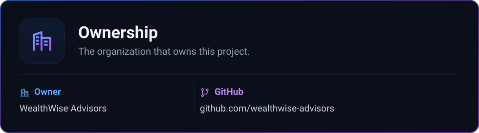</a>

<sub>

**[Organization ↗](https://github.com/wealthwise-advisors)** &nbsp;·&nbsp; **[Owner ↗](https://github.com/snandepu)**

</sub>

<br>

<a href="https://github.com/akxyverse">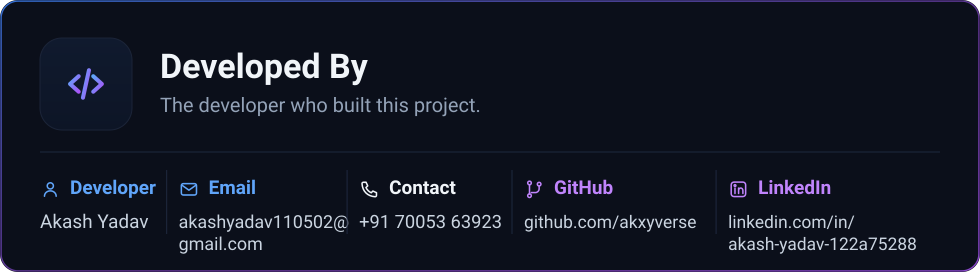</a>

<sub>

**[Email ↗](mailto:akashyadav110502@gmail.com)** &nbsp;·&nbsp; **[GitHub ↗](https://github.com/akxyverse)** &nbsp;·&nbsp; **[LinkedIn ↗](https://www.linkedin.com/in/akash-yadav-122a75288/)** &nbsp;·&nbsp; `+91 70053 63923`

</sub>

<br>

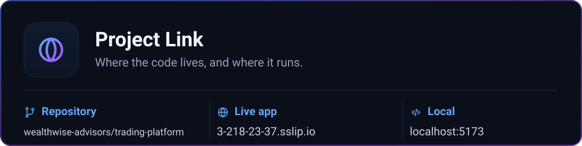

<sub>

**[Repository ↗](https://github.com/wealthwise-advisors/trading-platform)** &nbsp;·&nbsp; **[Live app ↗](https://3-218-23-37.sslip.io)** &nbsp;·&nbsp; `http://localhost:5173`

</sub>

---

<div align="center">

<sub><a href="#-table-of-contents">↑ Back to top</a></sub>

</div>
