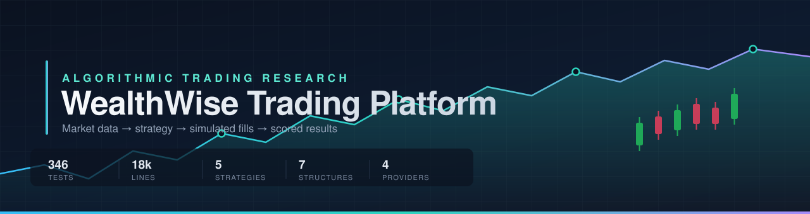
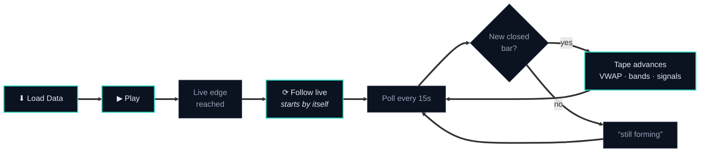
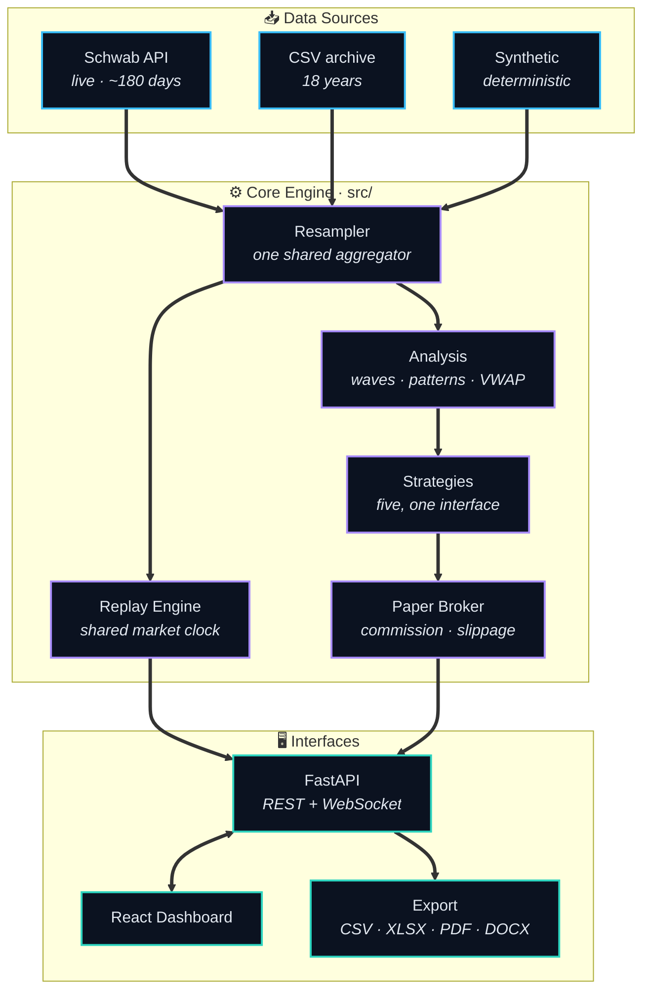
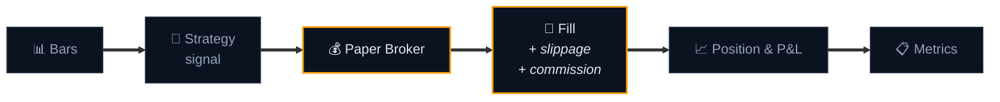
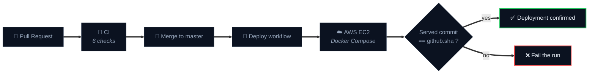
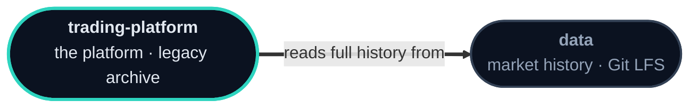

<div align="center">



<br><br>

### Market data goes in. A number you can defend comes out.

**AutoTrader** is a futures research platform: it reads the market, tests an idea
against it bar by bar, charges realistic costs for every fill, and follows the live
tape while it does. Built at **WealthWise Advisors**.

<br>

[](../../actions/workflows/ci.yml)
[](../../actions/workflows/deploy.yml)
[](#-testing--quality)

[](pyproject.toml)
[](api)
[](web)
[](web/tsconfig.json)
[](web/vite.config.ts)
[](requirements.txt)
[](web/package.json)
[](Dockerfile)
[](.github/workflows/deploy.yml)
[](src/data/schwab_provider.py)
[](pyproject.toml)
[](LICENSE)

</div>

<br>

<div align="center">

</div>

<br>

---

## 📑 Table of Contents

<table>
<tr><td valign="top" width="33%">

**◆ Understanding it**
- [About the Platform](#-about-the-platform)
- [Why It Exists](#-why-it-exists)
- [Highlights](#-highlights)
- [Live Replay](#-live-replay)

</td><td valign="top" width="33%">

**◆ How it works**
- [Architecture](#-architecture)
- [Project Workflow](#-project-workflow)
- [Market Intelligence](#-market-intelligence)
- [Strategy Engine](#-strategy-engine)
- [Backtesting & Execution](#-backtesting--execution)
- [Dashboard](#-dashboard)
- [API Reference](#-api-reference)

</td><td valign="top" width="33%">

**◆ Working with it**
- [Technology Stack](#-technology-stack)
- [Folder Structure](#-folder-structure)
- [Getting Started](#-getting-started)
- [Testing & Quality](#-testing--quality)
- [Deployment](#-deployment)
- [Repository Ecosystem](#-repository-ecosystem)
- [Documentation](#-documentation)

</td></tr>
</table>

<br>

---

## 🎯 About the Platform

Most trading tools tell you what to buy. **This one tells you whether you should
have believed the last thing that told you what to buy.**

AutoTrader is an instrument for measuring trading ideas. You give it an instrument,
a date range and a strategy; it replays the market bar by bar, executes the strategy
against a broker that charges commission and slippage on every fill, and hands back a
result you can reproduce exactly.

<table>
<tr>
<td width="33%" valign="top" align="center">

### 📖
**Read the market**

Elliott Wave structure, swing pivots, chart and candlestick patterns, VWAP with
deviation bands, volume profile, and a regime classifier that says whether the
market is trending, ranging or volatile.

</td>
<td width="33%" valign="top" align="center">

### ⚖️
**Test the idea**

Bar-by-bar replay with a paper broker. Commission per contract, slippage in ticks,
prices rounded to the real increment — a plausible fill, not a closing price.

</td>
<td width="33%" valign="top" align="center">

### 🔬
**Trust the number**

1,771 tests, deterministic runs, one shared bar aggregator, and a deploy that
refuses to succeed unless the server is actually running the commit it claims.

</td>
</tr>
</table>

> **What it is not.** Not a signal service, not an auto-trading bot, not a promise
> about tomorrow. Live *data* is production-ready; live *execution* is deliberately
> experimental and unwired. The output is evidence, and evidence is only worth
> something if you can say how it was produced.

<br>

---

## 💡 Why It Exists

A backtest is easy to write and very easy to fool yourself with. Four specific ways —
each one a real bug this codebase has hit and fixed — shape how the platform is built:

<table>
<tr><td width="6%" align="center">

**❶**

</td><td>

**A bar that changes after you have seen it.** A bar polled mid-minute has a high and
a low that are still moving. Show it, and every number derived from it is provisional
without saying so. → *Only closed bars ever reach the tape.*

</td></tr>
<tr><td align="center">

**❷**

</td><td>

**Two code paths that disagree about a bar.** Aggregation was once duplicated across
three providers; the copy that forgot to anchor to the session kept reintroducing
shifted bars. → *One aggregator, in [`src/data/resample.py`](src/data/resample.py).*

</td></tr>
<tr><td align="center">

**❸**

</td><td>

**A number that moves when you touch a checkbox.** The same 30-minute bar reported
two different VWAPs depending on which other timeframes were selected. → *Each bar
carries its own volume-weighted price, built from the minutes inside it.*

</td></tr>
<tr><td align="center">

**❹**

</td><td>

**A deploy that quietly changes nothing.** → *The pipeline asks the running server
which commit it is serving and fails the run unless it matches.*

</td></tr>
</table>

<br>

---

## ✨ Highlights

<table>
<tr>
<td width="50%" valign="top">

### 📡 Follows the live market
Load today, press Play, and the tape keeps up on its own — new bars land **within
~15 seconds of closing**. No reloading, no checkbox to remember.

</td>
<td width="50%" valign="top">

### 🌊 Elliott Wave engine
Thirteen modules — impulses, corrections, diagonals, triangles, combinations — with
explicit rules a count must satisfy and a hierarchy pass that nests degrees.

</td>
</tr>
<tr>
<td width="50%" valign="top">

### ⏱️ Eleven timeframes, one clock
Panes advance off a **shared market clock** measured in market time, not in bars, so
a 1m pane and a 1h pane always show the same instant.

</td>
<td width="50%" valign="top">

### 📊 Broker-accurate VWAP
Volume-weighted price per bar with σ bands at any level, colour-grouped by whole
number so agreement across timeframes is visible at a glance.

</td>
</tr>
<tr>
<td width="50%" valign="top">

### 💰 Costs that are actually charged
Commission per contract, slippage in ticks, tick-size rounding, and per-instrument
contract specifications so P&L lands in real currency.

</td>
<td width="50%" valign="top">

### 📤 Exports that match the screen
**CSV · XLSX · PDF · DOCX**, with charts rendered server-side from the same data the
dashboard drew.

</td>
</tr>
</table>

<br>

---

## 📡 Live Replay

<div align="center">

</div>

<br>

The flagship surface. A session loads history, plays it bar by bar, and then **keeps
going** — following the live market instead of stopping at the snapshot it loaded.



**What makes it trustworthy rather than merely live**

| | |
|---|---|
| **Only closed bars** | A bar polled mid-minute is still moving. Showing it puts a number on screen that changes afterwards — so it waits for the close |
| **Never silent** | The status line always states what is happening: `1 new bar, now at 15:56` · `the newest bar is still forming` · `could not reach the data source`. A quiet screen during an outage looks exactly like a calm market |
| **A pause is respected** | Following keeps the tape at the live edge; it does not drag you back from a bar you paused to study |
| **The gap is named** | *"1 min behind the clock — the current bar is still forming."* And when the gap exceeds what the design accounts for, it says the feed may be delayed instead of reassuring you |

> [!NOTE]
> **Why it looks one bar behind a broker platform.** thinkorswim draws the bar
> *currently forming*; this app draws the last bar that **closed**. Same instant,
> different bar. That is a difference in what is displayed, not a delay — and
> measured against the live feed, a closed bar reaches the tape in **5–16 seconds**.

<br>

---

## 🏗 Architecture



**The engine knows nothing about how it is called.** No HTTP, no React, no framework
inside [`src/`](src) — which is what lets the same analysis run from a test, from the
API and from a script and give the same answer each time.

<br>

---

## 🔄 Project Workflow

How a change actually travels from an idea to the live URL.

```mermaid
flowchart LR
    ID["💡 Idea"] ==> RE["🔬 Research<br/><i>measure it</i>"]
    RE ==> IM["⌨️ Implement<br/><i>+ tests that can fail</i>"]
    IM ==> VA["✅ Verify<br/><i>1,771 tests · ruff · tsc</i>"]
    VA ==> BR["📉 Backtest & Replay<br/><i>against real bars</i>"]
    BR ==> PR["🔀 Pull Request<br/><i>6 CI checks</i>"]
    PR ==> MG["🎯 Merge"]
    MG ==> DP["🚀 Deploy<br/><i>SHA asserted</i>"]
    DP ==> LV["🌐 Live"]

    classDef n fill:#0b1220,stroke:#334155,stroke-width:1px,color:#94a3b8
    classDef k fill:#0b1220,stroke:#2dd4bf,stroke-width:2px,color:#e2e8f0
    class ID,RE,IM,BR,PR,MG n
    class VA,DP,LV k
```



<table>
<tr><th width="18%">Stage</th><th>What has to be true to move on</th></tr>
<tr><td><b>Research</b></td><td>The problem is <i>measured</i>, not assumed. A reported "2-minute lag" was sampled nine times against the live feed before a line of code changed — which showed the provider was not the cause</td></tr>
<tr><td><b>Implement</b></td><td>A test exists that <b>fails against the previous commit</b>. A test that passes either way defends nothing</td></tr>
<tr><td><b>Verify</b></td><td>1,771 tests, <code>ruff</code>, and <code>npm run build</code> — <i>not</i> <code>tsc --noEmit</code>, which reports success on broken JSX</td></tr>
<tr><td><b>Deploy</b></td><td>The running server is asked which commit it serves. Mismatch fails the run</td></tr>
</table>

<br>

---

## 🔍 Market Intelligence

<table>
<tr><td valign="top" width="50%">

### 🌊 Elliott Wave
[`src/analysis/elliott_wave/`](src/analysis/elliott_wave)

- ➜ [`impulse`](src/analysis/elliott_wave/impulse.py) · [`correction`](src/analysis/elliott_wave/correction.py) · [`diagonal`](src/analysis/elliott_wave/diagonal.py)
- ➜ [`triangle`](src/analysis/elliott_wave/triangle.py) · [`combination`](src/analysis/elliott_wave/combination.py)
- ➜ [`pivots`](src/analysis/elliott_wave/pivots.py) — swing detection feeding the search
- ➜ [`hierarchy`](src/analysis/elliott_wave/hierarchy.py) — nesting wave degrees
- ➜ [`validation`](src/analysis/elliott_wave/validation.py) — **the rules a count must satisfy**
- ➜ [`measurements`](src/analysis/elliott_wave/measurements.py) · [`momentum`](src/analysis/elliott_wave/momentum.py)
- ➜ [`pipeline`](src/analysis/elliott_wave/pipeline.py) — the pass that ties it together

</td><td valign="top" width="50%">

### 📐 Price structure
[`src/analysis/`](src/analysis)

- ➜ [`swing_identification`](src/analysis/swing_identification.py) · [`zigzag`](src/analysis/zigzag.py) — the skeleton of a trend
- ➜ [`chart_patterns`](src/analysis/chart_patterns.py) — triangles, wedges, head-and-shoulders
- ➜ [`candlestick_patterns`](src/analysis/candlestick_patterns.py) — single and multi-bar formations
- ➜ [`indicators`](src/analysis/indicators.py) — RSI, Stochastic, moving averages, VWAP
- ➜ [`regime`](src/analysis/regime.py) — trending, ranging or volatile

</td></tr>
</table>

> **`validation` is the module that matters most.** Without it, a pattern search finds
> a "wave count" in any random walk you hand it.

**VWAP the way a broker platform computes it.** Each bar carries its own
volume-weighted price, built from the minutes inside it, rather than `(H+L+C)/3`.
Measured on the same closed 30-minute bar:

| Selection | Source | VWAP |
|---|---|---|
| 30m alone | 30m | 7810.2336 |
| 1m + 30m | 1m | **7809.9279** ← matches the reference platform |

Same bar, two answers, decided by a checkbox — which is exactly the class of
non-determinism the shared aggregator exists to kill.

<br>

---

## 🧠 Strategy Engine

Five strategies ship, all behind one interface
([`base_strategy.py`](src/strategies/base_strategy.py)), so any of them drops into any
run without the engine knowing which it holds.

| | Strategy | The idea |
|---|---|---|
| 🔀 | [**`rsi_divergence`**](src/strategies/rsi_divergence.py) | Price makes a new extreme, RSI does not — momentum failing to confirm |
| ↩️ | [**`rsi_mean_reversion`**](src/strategies/rsi_mean_reversion.py) | Fade an exhausted move back toward the mean |
| 📈 | [**`ma_crossover`**](src/strategies/ma_crossover.py) | Fast and slow moving averages crossing |
| 🚀 | [**`breakout`**](src/strategies/breakout.py) | Range resolution on expanding volume |
| 🎛️ | [**`regime_adaptive`**](src/strategies/regime_adaptive.py) | Switches behaviour on the [regime classifier's](src/analysis/regime.py) reading |

> **Each timeframe gets its own strategy instance and its own paper broker.**
> Strategies are stateful — RSI divergence arms a setup on one bar and confirms it
> several bars later — so sharing one instance would let an hourly bar corrupt the
> one-minute strategy's pre-conditions and silently change its signals.

<br>

---

## ⚙️ Backtesting & Execution



- ➜ **Fills are charged, not assumed** — commission per contract, slippage in ticks, prices rounded to the instrument's real increment
- ➜ **Contract specifications per instrument** — tick size, tick value and point value for ES, NQ, MES, CL and others, so P&L lands in real currency
- ➜ **Session-aware** — RTH, Globex (18:00–17:00) or 24-hour, with VWAP anchored to the session open rather than to midnight
- ➜ **Deterministic** — the same inputs produce the same output every time, which is what makes a rebuilt result comparable to the one it replaced

### One clock, eleven timeframes

The obvious implementation — keep N engines and step them all once per tick — does
**not** produce a synchronised view. `step()` advances one *bar*, and a bar is a
different amount of time on each timeframe: after 100 ticks a 1m pane has moved 100
minutes while a 1h pane has moved 100 hours.

So the clock is measured in **market time**. One tick advances time by exactly one
base bar; every other timeframe steps only when its next bar has *closed*. See
[`multi_replay.py`](src/backtesting/multi_replay.py).

<br>

---

## 📊 Dashboard

A React 19 single-page application over the FastAPI backend.

| Page | What it does |
|---|---|
| ⚡ [**Live Replay**](web/src/features/replay) | Multi-timeframe grid, consolidated tape, playback controls, live following |
| 📉 [**Backtest**](web/src/features/backtest) | Configure, run and read a scored result |
| 📤 [**Export Data**](web/src/features/export) | Pull bars out for use elsewhere |

- ➜ **Charts** — candles with VWAP, deviation bands, volume profile and wave overlays
- ➜ **Deviation colouring** — band values grouped by whole number, with disjoint palettes for upper and lower so the two can never be confused
- ➜ **Logic lives in [`web/src/lib`](web/src/lib)** — 279 tests run without a browser

<br>

---

## 🔌 API Reference

FastAPI, with interactive documentation at **`/docs`** while running.

| Area | Method | Endpoint | Purpose |
|---|---|---|---|
| Replay | `POST` | `/api/replay` | Create a session |
| Replay | `WS` | `/api/replay/ws/{id}` | Drive it bar by bar |
| Replay | `WS` | `↳ action: extend` | Pull bars that printed since |
| Backtest | `POST` | `/api/backtests` | Run and score a strategy |
| Market | `GET` | `/api/symbols` | Instruments and their specs |
| Market | `GET` | `/api/strategies` | Available strategies and parameters |
| Schwab | `GET` | `/api/schwab/status` | Auth state and token life |
| Export | `GET` | `/api/export/...` | CSV · XLSX · PDF · DOCX |
| Meta | `GET` | `/api/version` | Build commit — used by the deploy assertion |

See [`api/routers/`](api/routers) and the [API Guide](docs/API_GUIDE.md).

<br>

---

## 🛠 Technology Stack

<table>
<tr><td valign="top" width="33%">

### ⚙️ Backend
- **Python 3.12**
- FastAPI · Uvicorn
- pandas · numpy
- pandas-ta
- Pydantic
- pytest · ruff · mypy · bandit

</td><td valign="top" width="33%">

### 🖥 Frontend
- **React 19** · TypeScript
- Vite
- Tailwind CSS
- shadcn/ui · Radix
- Recharts
- Vitest · oxlint

</td><td valign="top" width="33%">

### ☁️ Infrastructure
- Docker · Compose
- GitHub Actions
- AWS EC2
- GitHub App auth
- Nginx

</td></tr>
</table>
<br>

---

## 📂 Folder Structure

> **Every name below is a link.** Click a folder to open it, or a file to read it.
> Each directory also carries its own README explaining what it holds and why.

▸ 🐍 **[`src/`](src)** — the engine — no HTTP, no React, no framework <sub>`61 files`</sub>  

&nbsp;&nbsp;&nbsp;&nbsp;&nbsp;&nbsp;➜ 🔍 **[`analysis/`](src/analysis)** — reading the market <sub>`22 files`</sub>  
&nbsp;&nbsp;&nbsp;&nbsp;&nbsp;&nbsp;&nbsp;&nbsp;&nbsp;<sub>[`candlestick_patterns.py`](src/analysis/candlestick_patterns.py) · [`chart_patterns.py`](src/analysis/chart_patterns.py) · [`indicators.py`](src/analysis/indicators.py) · [`regime.py`](src/analysis/regime.py) · [`swing_identification.py`](src/analysis/swing_identification.py) · [`zigzag.py`](src/analysis/zigzag.py)</sub>  

&nbsp;&nbsp;&nbsp;&nbsp;&nbsp;&nbsp;&nbsp;&nbsp;&nbsp;&nbsp;&nbsp;&nbsp;➜ 🌊 **[`elliott_wave/`](src/analysis/elliott_wave)** — wave detection, rules and hierarchy <sub>`14 files`</sub>  
&nbsp;&nbsp;&nbsp;&nbsp;&nbsp;&nbsp;&nbsp;&nbsp;&nbsp;&nbsp;&nbsp;&nbsp;&nbsp;&nbsp;&nbsp;<sub>[`combination.py`](src/analysis/elliott_wave/combination.py) · [`correction.py`](src/analysis/elliott_wave/correction.py) · [`diagonal.py`](src/analysis/elliott_wave/diagonal.py) · [`hierarchy.py`](src/analysis/elliott_wave/hierarchy.py) · [`impulse.py`](src/analysis/elliott_wave/impulse.py) · [`measurements.py`](src/analysis/elliott_wave/measurements.py) · [`models.py`](src/analysis/elliott_wave/models.py) · [`momentum.py`](src/analysis/elliott_wave/momentum.py) · <sub>+4 more</sub></sub>  

&nbsp;&nbsp;&nbsp;&nbsp;&nbsp;&nbsp;➜ 🧠 **[`strategies/`](src/strategies)** — turning a reading into a decision <sub>`8 files`</sub>  
&nbsp;&nbsp;&nbsp;&nbsp;&nbsp;&nbsp;&nbsp;&nbsp;&nbsp;<sub>[`base_strategy.py`](src/strategies/base_strategy.py) · [`breakout.py`](src/strategies/breakout.py) · [`ma_crossover.py`](src/strategies/ma_crossover.py) · [`regime_adaptive.py`](src/strategies/regime_adaptive.py) · [`rsi_divergence.py`](src/strategies/rsi_divergence.py) · [`rsi_mean_reversion.py`](src/strategies/rsi_mean_reversion.py)</sub>  

&nbsp;&nbsp;&nbsp;&nbsp;&nbsp;&nbsp;➜ ⏱ **[`backtesting/`](src/backtesting)** — replay engine and the shared market clock <sub>`8 files`</sub>  
&nbsp;&nbsp;&nbsp;&nbsp;&nbsp;&nbsp;&nbsp;&nbsp;&nbsp;<sub>[`engine.py`](src/backtesting/engine.py) · [`metrics.py`](src/backtesting/metrics.py) · [`multi_replay.py`](src/backtesting/multi_replay.py) · [`replay_engine.py`](src/backtesting/replay_engine.py) · [`results.py`](src/backtesting/results.py) · [`trade_quality.py`](src/backtesting/trade_quality.py)</sub>  

&nbsp;&nbsp;&nbsp;&nbsp;&nbsp;&nbsp;➜ 💰 **[`broker/`](src/broker)** — what a fill actually costs <sub>`5 files`</sub>  
&nbsp;&nbsp;&nbsp;&nbsp;&nbsp;&nbsp;&nbsp;&nbsp;&nbsp;<sub>[`base_broker.py`](src/broker/base_broker.py) · [`paper_broker.py`](src/broker/paper_broker.py) · [`rithmic_broker.py`](src/broker/rithmic_broker.py)</sub>  

&nbsp;&nbsp;&nbsp;&nbsp;&nbsp;&nbsp;➜ 📥 **[`data/`](src/data)** — providers, and one shared resampler <sub>`12 files`</sub>  
&nbsp;&nbsp;&nbsp;&nbsp;&nbsp;&nbsp;&nbsp;&nbsp;&nbsp;<sub>[`base_provider.py`](src/data/base_provider.py) · [`csv_provider.py`](src/data/csv_provider.py) · [`external_csv_provider.py`](src/data/external_csv_provider.py) · [`resample.py`](src/data/resample.py) · [`rithmic_provider.py`](src/data/rithmic_provider.py) · [`sample_data.py`](src/data/sample_data.py) · [`schwab_provider.py`](src/data/schwab_provider.py)</sub>  

&nbsp;&nbsp;&nbsp;&nbsp;&nbsp;&nbsp;➜ 📡 **[`live/`](src/live)** — live loop (experimental) <sub>`3 files`</sub>  
&nbsp;&nbsp;&nbsp;&nbsp;&nbsp;&nbsp;&nbsp;&nbsp;&nbsp;<sub>[`trader.py`](src/live/trader.py)</sub>  

▸ 🔌 **[`api/`](api)** — the FastAPI service <sub>`32 files`</sub>  

&nbsp;&nbsp;&nbsp;&nbsp;&nbsp;&nbsp;➜ 🛣 **[`routers/`](api/routers)** — REST endpoints and the replay socket <sub>`8 files`</sub>  
&nbsp;&nbsp;&nbsp;&nbsp;&nbsp;&nbsp;&nbsp;&nbsp;&nbsp;<sub>[`backtests.py`](api/routers/backtests.py) · [`data_export.py`](api/routers/data_export.py) · [`meta.py`](api/routers/meta.py) · [`optimize.py`](api/routers/optimize.py) · [`replay.py`](api/routers/replay.py) · [`schwab.py`](api/routers/schwab.py)</sub>  

&nbsp;&nbsp;&nbsp;&nbsp;&nbsp;&nbsp;➜ 📋 **[`schemas/`](api/schemas)** — request and response models <sub>`7 files`</sub>  
&nbsp;&nbsp;&nbsp;&nbsp;&nbsp;&nbsp;&nbsp;&nbsp;&nbsp;<sub>[`backtest.py`](api/schemas/backtest.py) · [`elliott_wave.py`](api/schemas/elliott_wave.py) · [`optimize.py`](api/schemas/optimize.py) · [`replay.py`](api/schemas/replay.py) · [`schwab.py`](api/schemas/schwab.py)</sub>  

&nbsp;&nbsp;&nbsp;&nbsp;&nbsp;&nbsp;➜ 📈 **[`report/`](api/report)** — charts rendered on the server <sub>`4 files`</sub>  
&nbsp;&nbsp;&nbsp;&nbsp;&nbsp;&nbsp;&nbsp;&nbsp;&nbsp;<sub>[`charts.py`](api/report/charts.py) · [`report.py`](api/report/report.py)</sub>  

&nbsp;&nbsp;&nbsp;&nbsp;&nbsp;&nbsp;➜ 📤 **[`export/`](api/export)** — CSV · XLSX · PDF · DOCX <sub>`4 files`</sub>  
&nbsp;&nbsp;&nbsp;&nbsp;&nbsp;&nbsp;&nbsp;&nbsp;&nbsp;<sub>[`formats.py`](api/export/formats.py) · [`report_export.py`](api/export/report_export.py)</sub>  

▸ 🖥 **[`web/`](web)** — the React dashboard <sub>`92 files`</sub>  

&nbsp;&nbsp;&nbsp;&nbsp;&nbsp;&nbsp;&nbsp;&nbsp;&nbsp;&nbsp;&nbsp;&nbsp;➜ 🪟 **[`features/`](web/src/features)** — replay, backtest and export pages <sub>`5 files`</sub>  

&nbsp;&nbsp;&nbsp;&nbsp;&nbsp;&nbsp;&nbsp;&nbsp;&nbsp;&nbsp;&nbsp;&nbsp;➜ 🎨 **[`components/`](web/src/components)** — shared UI <sub>`34 files`</sub>  

&nbsp;&nbsp;&nbsp;&nbsp;&nbsp;&nbsp;&nbsp;&nbsp;&nbsp;&nbsp;&nbsp;&nbsp;➜ 🧩 **[`lib/`](web/src/lib)** — pure logic, unit-tested away from React <sub>`31 files`</sub>  
&nbsp;&nbsp;&nbsp;&nbsp;&nbsp;&nbsp;&nbsp;&nbsp;&nbsp;&nbsp;&nbsp;&nbsp;&nbsp;&nbsp;&nbsp;<sub>[`api.ts`](web/src/lib/api.ts) · [`bandAgreement.test.ts`](web/src/lib/bandAgreement.test.ts) · [`bandAgreement.ts`](web/src/lib/bandAgreement.ts) · [`chartAxis.test.ts`](web/src/lib/chartAxis.test.ts) · [`clock.test.ts`](web/src/lib/clock.test.ts) · [`clock.ts`](web/src/lib/clock.ts) · [`dayRange.test.ts`](web/src/lib/dayRange.test.ts) · <sub>+23 more</sub></sub>  

▸ 🧪 **[`tests/`](tests)** — what every number on screen rests on <sub>`26 files`</sub>  
&nbsp;&nbsp;&nbsp;<sub>[`test_api_provider_errors.py`](tests/test_api_provider_errors.py) · [`test_engine.py`](tests/test_engine.py) · [`test_follow_live_matrix.py`](tests/test_follow_live_matrix.py) · [`test_indicator_correctness.py`](tests/test_indicator_correctness.py) · [`test_multi_replay.py`](tests/test_multi_replay.py) · [`test_provider_timeframes.py`](tests/test_provider_timeframes.py) · <sub>+7 more</sub></sub>  

▸ 📚 **[`docs/`](docs)** — architecture, rules and guides <sub>`19 files`</sub>  

▸ ⚙️ **[`config/`](config)** — settings and credential templates <sub>`3 files`</sub>  
&nbsp;&nbsp;&nbsp;<sub>[`credentials.yaml.example`](config/credentials.yaml.example) · [`settings.yaml`](config/settings.yaml)</sub>  

▸ 📈 **[`data/`](data)** — bundled samples, and where downloads land <sub>`18 files`</sub>  

▸ 🚀 **[`scripts/`](scripts)** — CLI entry points and the local launcher <sub>`5 files`</sub>  
&nbsp;&nbsp;&nbsp;<sub>[`download_rithmic_data.py`](scripts/download_rithmic_data.py) · [`generate_data.py`](scripts/generate_data.py) · [`run-autotrader.cmd`](scripts/run-autotrader.cmd) · [`run_backtest.py`](scripts/run_backtest.py)</sub>  

▸ 📄 **[`reports/`](reports)** — generated output <sub>`3 files`</sub>  

▸ 📦 **[`legacy/`](legacy)** — archived predecessor repositories <sub>`451 files`</sub>  

&nbsp;&nbsp;&nbsp;&nbsp;&nbsp;&nbsp;➜ 🔧 **[`workflows/`](.github/workflows)** — CI and deploy <sub>`3 files`</sub>  
&nbsp;&nbsp;&nbsp;&nbsp;&nbsp;&nbsp;&nbsp;&nbsp;&nbsp;<sub>[`ci.yml`](.github/workflows/ci.yml) · [`deploy.yml`](.github/workflows/deploy.yml) · [`probe-creds.yml`](.github/workflows/probe-creds.yml)</sub>

<br>

---

## 🚀 Getting Started

### ◆ Prerequisites

| | |
|---|---|
| 🐍 **Python 3.12** | **Not 3.14** — `pandas_ta` breaks on it and produces a test failure that looks real but is not |
| 🟢 **Node.js 20+** | For the dashboard |
| 🔑 **Schwab credentials** | Only for live data. CSV and synthetic sources work without any |

### ◆ 1 · Clone and install

```bash
git clone https://github.com/wealthwise-advisors/trading-platform.git
cd trading-platform

py -3.12 -m pip install -r requirements.txt
cd web && npm install && cd ..
```

### ◆ 2 · Configure

```bash
cp config/credentials.yaml.example config/credentials.yaml
```

Fill in your Schwab app key and secret.

> [!CAUTION]
> **`config/credentials.yaml` and `config/schwab_tokens.json` are gitignored and must
> never be committed.** Five predecessor repositories hardcoded live credentials into
> source files — see [`legacy/REDACTIONS.md`](legacy/REDACTIONS.md) for what that cost.

### ◆ 3 · Run it

```bash
# API  →  http://127.0.0.1:8000
py -3.12 -m uvicorn api.main:app --reload

# Web  →  http://localhost:5173
cd web && npm run dev
```

On Windows, [`scripts/run-autotrader.cmd`](scripts/run-autotrader.cmd) does both —
frees the ports first and pins the right Python.

> [!TIP]
> Open **`http://localhost:5173`**, not `127.0.0.1:5173`. Vite binds to IPv6 only, so
> the numeric address is refused — that "site can't be reached" error is the address,
> not a broken app.

### ◆ 4 · First run

<table>
<tr><td width="6%" align="center"><b>1</b></td><td><b>Data Source</b> → <i>Live Data (Schwab)</i></td></tr>
<tr><td align="center"><b>2</b></td><td><b>Start</b> and <b>End</b> → today's date, both</td></tr>
<tr><td align="center"><b>3</b></td><td>Tick <b>1m</b> under Timeframes</td></tr>
<tr><td align="center"><b>4</b></td><td><b>⬇ Load Data</b> → <b>▶ Play</b></td></tr>
<tr><td align="center"><b>5</b></td><td><b>Touch nothing else.</b> At 100% the tape starts following the live market on its own</td></tr>
</table>

<br>

---

## 🧪 Testing & Quality

```bash
py -3.12 -m pytest              # 1,492 Python tests
cd web && npm test              #   279 web tests
cd web && npm run build         # tsc -b — the real typecheck
py -3.12 -m ruff check .        # lint
```

<div align="center">

| Suite | Count | Covers |
|:---|---:|:---|
| 🐍 **Python** | **1,492** | engine, analysis, API, providers, replay |
| ⚛️ **Web** | **279** | pure logic in [`web/src/lib`](web/src/lib) |
| **Total** | **1,771** | |

</div>

### ◆ What the tests defend

- ➜ **Follow-live across every timeframe** — all eleven, every position within a bar, seven combinations, five dates including both DST switches and a leap day
- ➜ **Bar aggregation** — one aggregator, session-anchored, so no two paths can disagree about what a bar is
- ➜ **Determinism** — a session grown bar by bar must be byte-identical to one handed all the data at once
- ➜ **Elliott Wave rules** — a count that breaks a rule must be rejected
- ➜ **Error messages** — a bad request must name the field to change, not return a 500

### ◆ A test earns its place by being able to fail

The [follow-live matrix](tests/test_follow_live_matrix.py) was written after a bug
that only appeared on timeframes coarser than 1m. **67 of its 107 cases fail against
the commit that shipped that bug** — which is the property that makes it worth
running. A test that passes either way defends nothing.

> [!WARNING]
> `npx tsc --noEmit` reports **success on broken JSX**, because the root tsconfig is a
> solution file with project references only. **`npm run build` (`tsc -b`) is the real
> typecheck.**

<br>

---

## 📦 Deployment



Every deploy asks the running server which commit it is serving and **fails the run
unless it matches**. A deploy that quietly leaves the old build running is the exact
failure this exists to catch.

| | |
|---|---|
| 🔐 **Auth** | GitHub App installation token, minted per run and revoked when the job ends |
| 🛡️ **Firewall** | The SSH rule is opened for the run and **always** revoked, even if the run fails |
| 🔑 **Tokens** | Schwab tokens follow **newer-wins**, so a container's own refresh is never clobbered by a redeploy |
| ✅ **Proof** | `CONFIRMED: port 80 is served by <sha>` appears in the log, or the run goes red |

<br>

---

## 🗂 Repository Ecosystem



| Repository | Purpose | |
|---|---|---|
| **trading-platform** | This repository — the platform, plus [`legacy/`](legacy) | *you are here* |
| **data** | Full market history in Git LFS, including an **18-year 1-minute ES series** too large for an ordinary repository | [Open ↗](https://github.com/wealthwise-advisors/data) |

**Five predecessor repositories were consolidated into [`legacy/`](legacy) and
retired** — `trading-strategy`, `trading-web`, `Wealthwise`, `backtest` and
`Project_work`. Their 442 files live on here; hardcoded credentials were stripped on
the way in and recorded in [`legacy/REDACTIONS.md`](legacy/REDACTIONS.md).

`legacy/` is reference only — excluded from linting, from the test suite, and from
every Docker image.

<br>

---

## 📚 Documentation

<table>
<tr><td valign="top" width="50%">

### ◆ Getting oriented
- 📗 [Quickstart](docs/QUICKSTART.md)
- 📘 [Installation](docs/INSTALLATION.md)
- 📙 [Configuration](docs/CONFIGURATION.md)
- ❓ [FAQ](docs/FAQ.md)
- 🔧 [Troubleshooting](docs/TROUBLESHOOTING.md)

</td><td valign="top" width="50%">

### ◆ Going deeper
- 🏛 [Architecture](docs/ARCHITECTURE.md)
- 👩‍💻 [Developer Guide](docs/DEVELOPER_GUIDE.md)
- 🔌 [API Guide](docs/API_GUIDE.md)
- 🌊 Elliott Wave — [rules](docs/ELLIOTT_WAVE_RULES.md) · [architecture](docs/ELLIOTT_WAVE_ARCHITECTURE.md) · [implementation](docs/ELLIOTT_WAVE_IMPLEMENTATION.md) · [SRS](docs/ELLIOTT_WAVE_SRS.md)
- 🔒 [Security Audit](docs/SECURITY_AUDIT.md)
- 📋 [Release Notes](docs/RELEASE_NOTES.md) · [Audit](docs/RELEASE_AUDIT.md)

</td></tr>
</table>

Every directory also has its own README — [`src/`](src/README.md) ·
[`api/`](api/README.md) · [`web/src/lib/`](web/src/lib/README.md) ·
[`tests/`](tests/README.md) · [`config/`](config/README.md) and the rest.

<br>

---

## ⚠️ Disclaimer

**For research and education. Not investment advice.**

Futures trading carries substantial risk of loss and is not suitable for every
investor. Backtested results are hypothetical: they benefit from hindsight, cannot
account for every market condition, and **do not predict future performance**.

Nothing here should be traded with real money without independent validation and your
own understanding of the risk.

<br>

---

## 📄 License

Proprietary — © **WealthWise Advisors**. All rights reserved. See [LICENSE](LICENSE).

<br>

<div align="center">

### Built for research that has to hold up.

<sub>If a number is on the screen, something in <a href="tests">tests/</a> defends it.</sub>

<br><br>

<sub><a href="#-table-of-contents">↑ Back to top</a></sub>

</div>
