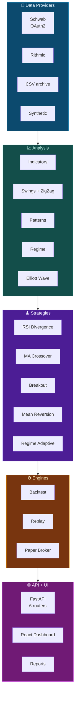

<div align="center">

# ⚡ WealthWise Trading Platform

### **Algorithmic Trading · Market Structure Analysis · Strategy Research**

**Futures backtesting from market data to scored results — with an engine that says
"I don't know" instead of guessing.**

<br>


<br>


&nbsp;

&nbsp;

&nbsp;


</div>

<br>

---

## 🎯 What This Is

A futures trading research platform. Load market data, run a strategy over it,
simulate fills the way a broker would, and score the result on risk-adjusted
metrics — through a browser, a CLI, or a bar-by-bar replay.

**Instruments** ES · NQ · CL · MES · HG &nbsp;·&nbsp;
**Timeframes** 1m · 5m · 15m · 1h &nbsp;·&nbsp;
**Data** Schwab · Rithmic · CSV · synthetic

Two design rules run through the codebase:

> ⏳ **No look-ahead.** Orders fill on the **next** bar's open, never the signal bar.
> Pivots carry both the bar where the extreme happened and the later bar that
> confirmed it. Tests truncate history and assert nothing appears early.

> 🎯 **Unknown is a valid answer.** The Elliott Wave engine returns `UNDECIDABLE`
> and names the open question that blocked it, rather than inventing a verdict.
> There is no confidence score anywhere — the source material doesn't support one.

<br>

| &nbsp; | Capability | Detail |
|:-:|---|---|
| 📡 | **Market Data** | 4 providers behind one interface, with resampling and chunked fetching |
| 📈 | **Technical Analysis** | RSI · Stochastic · EMA · ATR |
| 〰️ | **Market Structure** | Swing identification, nested zigzag with per-swing labelling |
| 🕯️ | **Pattern Detection** | Candlestick and multi-bar chart patterns |
| 🧠 | **Regime Detection** | Market-state classification driving adaptive behaviour |
| 🌊 | **Elliott Wave** | 13-module engine · 7 wave structures · explicit uncertainty |
| ♟️ | **Strategy Engine** | 5 strategies on a shared interface |
| 🧪 | **Backtesting** | Next-bar fills, slippage, session filtering |
| 🔄 | **Replay** | WebSocket-driven bar-by-bar playback |
| 💵 | **Paper Broker** | Market, limit and stop orders with realistic triggering |
| 📊 | **Dashboard** | React 19 + Plotly, 7 chart types |
| 📤 | **Export** | Self-contained HTML · Excel · PDF · DOCX |

---

## 🏗️ Architecture



| Layer | Module | Responsibility |
|---|---|---|
| 📡 Data | [`src/data/`](src/data) | Provider abstraction, resampling, contract specs |
| 📈 Analysis | [`src/analysis/`](src/analysis) | Indicators, structure, patterns, regime, waves |
| ♟️ Strategy | [`src/strategies/`](src/strategies) | Signal generation on `BaseStrategy` |
| ⚙️ Execution | [`src/backtesting/`](src/backtesting) · [`src/broker/`](src/broker) | Simulation, fills, metrics |
| 🌐 Serving | [`api/`](api) · [`web/`](web) | REST + WebSocket, dashboard, exports |

---

## 📡 Data Layer

Four providers behind one `DataProvider` interface — swap the source, the rest of
the stack doesn't change.

| Provider | Source | Notes |
|---|---|---|
| [`schwab_provider.py`](src/data/schwab_provider.py) | Schwab API | OAuth2, 30-min token auto-refresh, 30-day request chunking |
| [`rithmic_provider.py`](src/data/rithmic_provider.py) | Rithmic R\|API+ | Native bar periods, resamples for 1h |
| [`external_csv_provider.py`](src/data/external_csv_provider.py) | Local archive | Year-file aware, resamples from 1-minute source |
| [`csv_provider.py`](src/data/csv_provider.py) | Project CSVs | Standard OHLCV layout |
| [`sample_data.py`](src/data/sample_data.py) | Generated | Seeded GBM with regimes — deterministic tests, no account needed |

Contract specifications per instrument — tick size, tick value, point value,
margin — live in [`config/settings.yaml`](config/settings.yaml).

---

## 🔬 Market Analysis

<table>
<tr><td valign="top" width="50%">

**📈 Indicators** — [`indicators.py`](src/analysis/indicators.py)

RSI · Stochastic %K/%D · EMA · ATR

**〰️ Market Structure**

[`swing_identification.py`](src/analysis/swing_identification.py)
[`zigzag.py`](src/analysis/zigzag.py)

Nested zigzag with fixed-channel per-swing
numbering, held by a 29-test regression baseline

</td><td valign="top" width="50%">

**🕯️ Patterns**

[`candlestick_patterns.py`](src/analysis/candlestick_patterns.py)
[`chart_patterns.py`](src/analysis/chart_patterns.py)

**🧠 Regime Detection** — [`regime.py`](src/analysis/regime.py)

Classifies market state; drives the
adaptive strategy

</td></tr>
</table>

---

## 🌊 Elliott Wave Engine

> **The deepest piece of engineering in this repository** — a wave classifier
> built to be honest about what it cannot determine.

<div align="center">

**13 modules** &nbsp;·&nbsp; **7 wave structures** &nbsp;·&nbsp;
**9 test modules** &nbsp;·&nbsp; **27 open questions tracked** &nbsp;·&nbsp;
**0 confidence scores**

</div>

A package in [`src/analysis/elliott_wave/`](src/analysis/elliott_wave), built
from scratch against a single approved reference.

**Structures** — Impulse · Leading Diagonal · Ending Diagonal · Zigzag · Flat ·
Running Flat · Double Three · Triple Three

| Design decision | Why |
|---|---|
| **Purpose-built pivot detector** | Threshold-based directional change across a multi-scale ladder, deliberately independent of the existing swing/zigzag code |
| **`UNDECIDABLE` lifecycle state** | `ENUMERATED → GATED → MEASURED`, plus `UNDECIDABLE` when a rule can't be evaluated. No `INVALID`, no confidence score |
| **Blocked-rule registry** | Every unevaluated rule is reported at runtime with the open question behind it — a partial analysis never reads as complete |
| **Guard tests** | Assert that no blocked rule has been quietly implemented with an invented threshold |

Of 27 catalogued open questions: **6 resolved · 20 unresolved · 1 not implementable.**
Where the reference is silent, the engine says so.

📄 [Implementation record](docs/ELLIOTT_WAVE_IMPLEMENTATION.md) ·
[Rule inventory](docs/ELLIOTT_WAVE_RULES.md) ·
[Requirements](docs/ELLIOTT_WAVE_SRS.md) ·
[Architecture](docs/ELLIOTT_WAVE_ARCHITECTURE.md)

---

## ♟️ Strategy Engine

Implement `on_bar()`, register it, and the dashboard picks it up automatically —
no per-strategy UI wiring.

| Strategy | Signal logic | Module |
|---|---|---|
| 🔍 **RSI Divergence** | Price/RSI divergence arms a setup; a close beyond the divergence bar confirms entry | [`rsi_divergence.py`](src/strategies/rsi_divergence.py) |
| 📊 **MA Crossover** | Fast EMA crossing slow EMA | [`ma_crossover.py`](src/strategies/ma_crossover.py) |
| 🚀 **Breakout** | Donchian channel break with ATR trailing stop | [`breakout.py`](src/strategies/breakout.py) |
| ↩️ **Mean Reversion** | RSI oversold/overbought reversion | [`rsi_mean_reversion.py`](src/strategies/rsi_mean_reversion.py) |
| 🧭 **Regime Adaptive** | Switches behaviour on detected market regime | [`regime_adaptive.py`](src/strategies/regime_adaptive.py) |

> **RSI Divergence** is the primary research line — a two-step pre-condition /
> post-condition entry rather than acting on divergence alone.

---

## 🧪 Backtesting & Execution

**Order model** — [`paper_broker.py`](src/broker/paper_broker.py)

| Order | Fill rule |
|---|---|
| Market | Next bar's open ± slippage |
| Limit | Fills when the bar's low/high crosses the limit price |
| Stop | Triggers when price crosses the stop level |

**Engines**

| Engine | Behaviour | Module |
|---|---|---|
| 🧪 Backtest | Runs the full range, returns complete results | [`engine.py`](src/backtesting/engine.py) |
| 🔄 Replay | `step()` returns one `FrameState` per bar, driven over WebSocket | [`replay_engine.py`](src/backtesting/replay_engine.py) |
| 💵 Paper Broker | Simulated fills against the same interface a live broker implements | [`paper_broker.py`](src/broker/paper_broker.py) |

Session filtering trims bars to trading hours after load, before signals run.

---

## 📉 Metrics

Computed in [`metrics.py`](src/backtesting/metrics.py) and
[`results.py`](src/backtesting/results.py).

| Group | Measures |
|---|---|
| **Risk-adjusted** | Sharpe ratio · Sortino ratio · profit factor |
| **Drawdown** | max drawdown % · equity curve |
| **Outcome** | win rate · total return % · average win / loss |
| **Behaviour** | average trade duration · per-trade P&L with entry/exit prices, times and commission |

Plus [`trade_quality.py`](src/backtesting/trade_quality.py) scoring and a
parameter optimiser at [`optimize.py`](api/routers/optimize.py).

---

## 📊 Dashboard

React 19 + TypeScript in [`web/`](web) — Tailwind, shadcn/ui, Radix, TanStack
Query, Zustand.

| Chart | Shows |
|---|---|
| [`CandlestickChart`](web/src/components/charts/CandlestickChart.tsx) | Price with EMAs, zigzag and trade markers, over RSI(2) · Stochastic (toggleable) · RSI(13) panes |
| [`ElliottWaveChart`](web/src/components/charts/ElliottWaveChart.tsx) | Hierarchical nested wave labels with leader lines |
| [`EquityChart`](web/src/components/charts/EquityChart.tsx) | Account curve |
| [`PnlDistributionChart`](web/src/components/charts/PnlDistributionChart.tsx) | Trade outcome spread |
| [`WinLossDonut`](web/src/components/charts/WinLossDonut.tsx) | Outcome breakdown |
| [`MonthlyReturnsHeatmap`](web/src/components/charts/MonthlyReturnsHeatmap.tsx) | Calendar heatmap |
| [`LiveReplayChart`](web/src/components/charts/LiveReplayChart.tsx) | Animated playback |

**Pages** — [Backtest config](web/src/features/backtest/ConfigForm.tsx) ·
[Results](web/src/features/backtest/ResultsPage.tsx) ·
[Live Replay](web/src/features/replay/ReplayPage.tsx) ·
[Data Export](web/src/features/export/DataExportPage.tsx)

Plus a trade log, candlestick and chart-pattern tables, and an optimiser panel.

---

## 🔌 API

FastAPI, six routers under `/api` — [`api/routers/`](api/routers)

| Router | Purpose |
|---|---|
| [`backtests.py`](api/routers/backtests.py) | Run backtests, fetch results, export reports |
| [`replay.py`](api/routers/replay.py) | WebSocket bar-by-bar streaming |
| [`optimize.py`](api/routers/optimize.py) | Parameter sweeps |
| [`data_export.py`](api/routers/data_export.py) | Excel, PDF, DOCX, CSV |
| [`schwab.py`](api/routers/schwab.py) | OAuth flow and token status |
| [`meta.py`](api/routers/meta.py) | Strategy registry, data-source availability |

📄 [API Guide](docs/API_GUIDE.md)

---

## 🛠️ Tech Stack

<table>
<tr><td valign="top" width="33%">

**Backend**

`FastAPI` `Uvicorn` `Pydantic v2`
`websockets` `loguru`

**Data & Quant**

`pandas` `NumPy` `pandas-ta`

</td><td valign="top" width="33%">

**Frontend**

`React 19` `TypeScript` `Vite`
`Tailwind` `shadcn/ui` `Radix`
`TanStack Query` `Zustand`
`framer-motion`

**Charts**

`Plotly` `react-plotly.js` `Recharts`

</td><td valign="top" width="33%">

**Integrations**

`schwabdev` — vendored

`pyrithmic` — optional

**Export**

`openpyxl` `reportlab` `python-docx`

**Quality & Ops**

`pytest` `ruff` `mypy` `bandit`
`Docker` `GitHub Actions`

</td></tr>
</table>

---

## 🔄 End-to-End Workflow

```
1  Configure   instrument · timeframe · dates · strategy · parameters
2  Load        provider returns OHLCV → engine trims to session hours
3  Analyse     indicators · swings · patterns · regime · wave structures
4  Signal      strategy evaluates each bar → BUY / SELL / CLOSE
5  Execute     paper broker fills on the next bar's open, applying slippage
6  Score       Sharpe · Sortino · drawdown · profit factor · win rate
7  Visualise   dashboard renders charts, trade log, pattern tables
8  Export      HTML · Excel · PDF · DOCX
```

---

## 📁 Project Structure

**44 directories · 227 files · 184 tracked**

```text
trading-platform/
│
├── 📂 src/                             engine — 93 Python files
│   ├── analysis/
│   │   ├── elliott_wave/               13 modules · 7 wave structures
│   │   │   ├── pivots.py               multi-scale directional-change detector
│   │   │   ├── impulse.py              IMP-01…06
│   │   │   ├── diagonal.py             leading / ending
│   │   │   ├── correction.py           zigzag · flat · running flat
│   │   │   ├── combination.py          double / triple three
│   │   │   ├── triangle.py             candidate measurement
│   │   │   ├── measurements.py         guideline ratios — records, never matches
│   │   │   ├── validation.py           blocked-rule registry
│   │   │   └── pipeline.py             the one correct call order
│   │   ├── indicators.py               RSI · Stochastic · EMA · ATR
│   │   ├── swing_identification.py     swing highs / lows
│   │   ├── zigzag.py                   nested zigzag + labelling
│   │   ├── candlestick_patterns.py
│   │   ├── chart_patterns.py
│   │   └── regime.py                   market-state classification
│   │
│   ├── strategies/                     5 strategies + BaseStrategy ABC
│   ├── data/                           5 providers + DataProvider ABC
│   │   └── schwabdev/                  vendored Schwab client
│   ├── backtesting/                    engine · replay · metrics · results
│   ├── broker/                         paper · rithmic · BaseBroker ABC
│   └── live/                           live trader (stub)
│
├── 📂 api/                             FastAPI backend
│   ├── routers/                        6 endpoints
│   ├── schemas/                        Pydantic request/response models
│   ├── report/                         self-contained HTML generator
│   ├── export/                         Excel · PDF · DOCX
│   ├── serializers.py                  domain → JSON
│   └── strategy_registry.py            strategy discovery for the UI
│
├── 📂 web/                             React 19 + TypeScript — 32 TSX files
│   └── src/
│       ├── components/  charts/ (7) · cards/ · tables/ · ui/
│       ├── features/    backtest/ · replay/ · export/
│       ├── lib/         typed API client, types, insights
│       └── store/       Zustand config store
│
├── 📂 tests/                           346 tests
│   ├── test_elliott_wave/              9 modules incl. TR-2 guard tests
│   ├── test_engine.py                  backtest smoke tests
│   └── test_swing_zigzag_regression.py 29-test structural baseline
│
├── 📂 docs/                            16 documents
├── 📂 scripts/                         CLI backtest · data generation · downloads
├── 📂 config/                          settings.yaml · credentials template
├── 📂 reports/                         generated HTML output
│
├── 🔄 .github/workflows/ci.yml         lint · typecheck · tests · build · security
├── 🐳 Dockerfile · web/Dockerfile · web/nginx.conf · docker-compose.yml
├── ⚙️ pyproject.toml · requirements.txt · .env.example
└── 📄 README.md · CHANGELOG.md · CONTRIBUTING.md · LICENSE
```

---

## ⚙️ Running It

**Requirements** — Python 3.12 · Node 18+

```bash
# Backend — http://localhost:8000
py -3.12 -m pip install -r requirements.txt
py -3.12 -m uvicorn api.main:app --reload --port 8000

# Frontend — http://localhost:5173, proxies /api/* to the backend
cd web && npm install && npm run dev
```

```bash
# CLI backtest, no UI
py -3.12 scripts/run_backtest.py --symbol ES --strategy ma --fast 9 --slow 21

# Generate synthetic data for every configured symbol
py -3.12 scripts/generate_data.py

# Tests
py -3.12 -m pytest tests/ -v
```

```bash
# Or the whole stack — API on :8000, dashboard on :8080
docker compose up
```

> Synthetic data works out of the box — no broker account needed. Copy
> [`.env.example`](.env.example) to `.env` only for the optional live
> integrations it documents.

📄 [Installation](docs/INSTALLATION.md) · [Quickstart](docs/QUICKSTART.md) ·
[Configuration](docs/CONFIGURATION.md)

---

## 📚 Documentation

<table>
<tr><td valign="top" width="50%">

**Getting started**

- 📘 [Quickstart](docs/QUICKSTART.md)
- 🔧 [Installation](docs/INSTALLATION.md)
- ⚙️ [Configuration](docs/CONFIGURATION.md)
- ❓ [FAQ](docs/FAQ.md)
- 🩺 [Troubleshooting](docs/TROUBLESHOOTING.md)

**Engineering**

- 🏛️ [Architecture](docs/ARCHITECTURE.md)
- 🔌 [API Guide](docs/API_GUIDE.md)
- 👩‍💻 [Developer Guide](docs/DEVELOPER_GUIDE.md)

</td><td valign="top" width="50%">

**Elliott Wave**

- 📐 [Rule inventory](docs/ELLIOTT_WAVE_RULES.md)
- 📋 [Requirements (SRS)](docs/ELLIOTT_WAVE_SRS.md)
- 🏗️ [Architecture](docs/ELLIOTT_WAVE_ARCHITECTURE.md)
- 📖 [Implementation record](docs/ELLIOTT_WAVE_IMPLEMENTATION.md)

**Release**

- 📝 [Changelog](CHANGELOG.md)
- 🔒 [Security audit](docs/SECURITY_AUDIT.md)
- ✅ [Verification report](docs/VERIFICATION_REPORT.md)
- 🔍 [Release audit](docs/RELEASE_AUDIT.md)
- 🚀 [Release notes](docs/RELEASE_NOTES.md)
- 🤝 [Contributing](CONTRIBUTING.md)

</td></tr>
</table>

---

## 📈 Development Status

| Component | Status |
|---|---|
| Backtest engine · paper broker · metrics | 🟢 Working |
| 5 strategies · indicators · patterns · regime | 🟢 Working |
| Elliott Wave engine (7 structures) | 🟢 Working |
| React dashboard · 7 charts · exports | 🟢 Working |
| REST + WebSocket API | 🟢 Working |
| Live Rithmic connection | 🟡 Stubbed — `RithmicBroker` raises `NotImplementedError` |
| Options support | 🔵 Planned |
| Multi-symbol backtests | 🔵 Planned — the engine runs one symbol at a time |

---

## 🚧 Current Development

- 🌊 **Elliott Wave coverage** — Triangle stays measurement-only until "sideways"
  can be defined; Fibonacci matching waits on a tolerance model that neither the
  reference nor the data supports
- 🔗 **Live broker wiring** — `RithmicBroker.connect()` against the pattern
  `RithmicDataProvider` already uses
- 📐 **Motive-parent nesting** — impulses confirm overwhelmingly at scale 1, where
  IMP-02 is undecidable, so classic nested sub-waves are rare. Documented as an
  accepted consequence of the threshold ladder, not a defect

---

## 🗺️ Open Research Questions

The Elliott Wave engine tracks **27** catalogued questions where the reference is
ambiguous or silent — **6 resolved, 20 unresolved, 1 not implementable**.

Each is recorded with the rules it blocks and why, surfaced at runtime through
`AnalysisResult.blocked_rules`, and guarded by tests that fail if anyone quietly
fills the gap with an invented value.

📄 [Full inventory](docs/ELLIOTT_WAVE_RULES.md)

---

## 🔗 Related Repositories

| Repository | Contents |
|---|---|
| [my-trading-projects](https://github.com/akxyverse/my-trading-projects) | Swings-divergence strategy research |
| [trading-strategy](https://github.com/wealthwise-advisors/trading-strategy) | Earlier strategy and signal work |
| [trading-web](https://github.com/wealthwise-advisors/trading-web) | Earlier web execution layer |
| [backtest](https://github.com/wealthwise-advisors/backtest) | Earlier backtesting harness |
| [data](https://github.com/wealthwise-advisors/data) | Market-data archives |

---

## 📜 License

Proprietary — Copyright © 2026 WealthWise Advisors. All rights reserved.
See [LICENSE](LICENSE).

---

## ⚠️ Disclaimer

> Built for research and software development. **Not financial advice.** Trading
> carries substantial risk of loss. Backtested and simulated results do not
> indicate future performance, and nothing here should be treated as a system
> that produces profit.

<div align="center">

<br>

**[github.com/akxyverse](https://github.com/akxyverse)**

</div>
