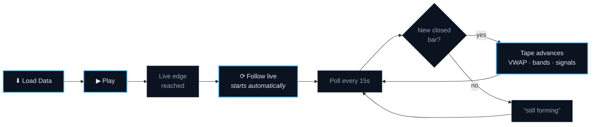
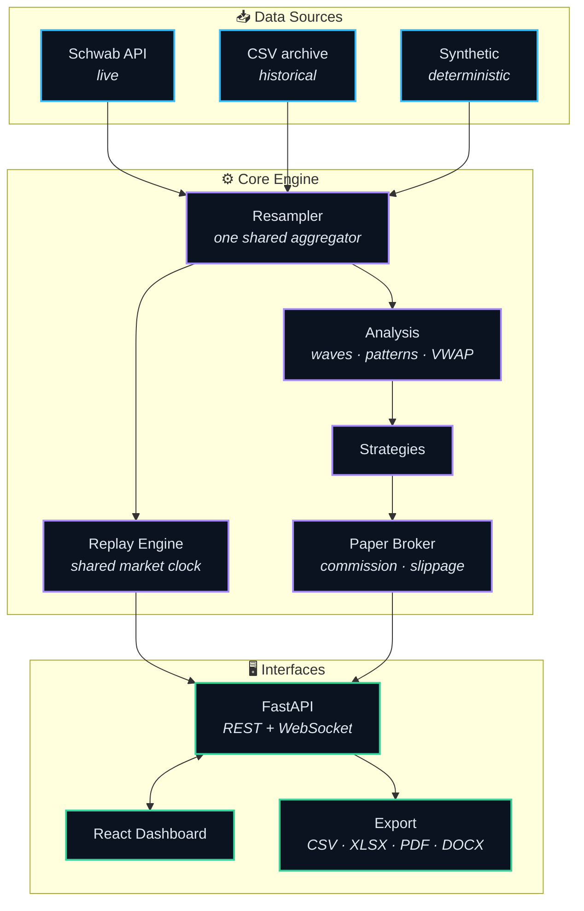
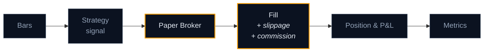
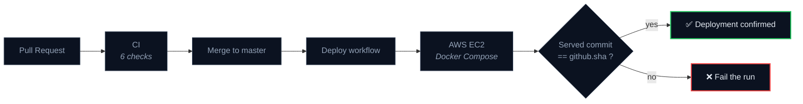
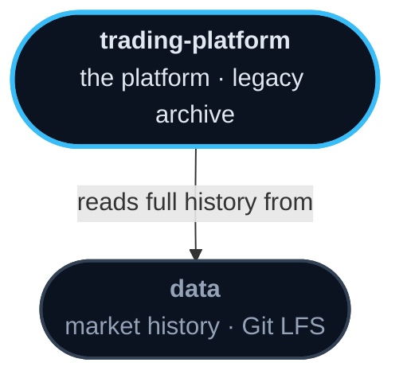

<div align="center">


<br>

**Algorithmic trading research, from raw market data to a scored result.**

*Elliott Wave analysis · VWAP deviation bands · multi-timeframe replay · live market following*

<br>

[](../../actions/workflows/ci.yml)
[](../../actions/workflows/deploy.yml)
[](#-testing--quality)

[](pyproject.toml)
[](api)
[](web)
[](web/tsconfig.json)
[](web/vite.config.ts)
[](requirements.txt)
[](Dockerfile)
[](src/data/schwab_provider.py)
[](pyproject.toml)
[](LICENSE)

</div>

<br>

---

## 📑 Table of Contents

<table>
<tr><td valign="top" width="33%">

**Understanding it**
- [What is AutoTrader?](#-what-is-autotrader)
- [Highlights](#-highlights)
- [Live Replay](#-live-replay)
- [High-Level Architecture](#-high-level-architecture)

</td><td valign="top" width="33%">

**What it does**
- [Market Intelligence](#-market-intelligence)
- [Strategy Engine](#-strategy-engine)
- [Backtesting & Execution](#-backtesting--execution)
- [Dashboard & Analytics](#-dashboard--analytics)
- [API](#-api)

</td><td valign="top" width="33%">

**Working with it**
- [Technology Stack](#-technology-stack)
- [Project Structure](#-project-structure)
- [Getting Started](#-getting-started)
- [Testing & Quality](#-testing--quality)
- [Deployment](#-deployment)
- [Repository Ecosystem](#-repository-ecosystem)

</td></tr>
</table>

<br>

---

## 🎯 What is AutoTrader?

A research platform for building and testing futures trading strategies. Market data
goes in one end; a scored, reproducible result comes out the other.

It answers three questions, in order:

> **➜ What is the market doing?**
> Elliott Wave structure, swing pivots, chart and candlestick patterns, VWAP with
> deviation bands, volume profile, and a regime classifier.
>
> **➜ What would this strategy have done?**
> A bar-by-bar replay engine with a paper broker that charges commission and
> slippage, so a result is a plausible fill rather than a closing price.
>
> **➜ Is that result trustworthy?**
> 1,771 tests, deterministic runs, and one shared bar aggregator so no two code
> paths can disagree about what a bar is.

**Not** a signal service or an auto-trading bot. It is a measuring instrument — the
point is a number you can defend.

<br>

---

## ✨ Highlights

<table>
<tr>
<td width="50%" valign="top">

### 📡 Live market following
Load today's session, press Play, and the tape keeps up with the market on its
own — new bars arrive within **~15 seconds of closing**, no reloading.

</td>
<td width="50%" valign="top">

### 🌊 Elliott Wave engine
Thirteen modules covering impulses, corrections, diagonals, triangles and
combinations, with a hierarchy pass that nests degrees.

</td>
</tr>
<tr>
<td width="50%" valign="top">

### ⏱️ Multi-timeframe, one clock
Up to eleven timeframes advance off a **shared market clock**, so every pane shows
the same instant instead of drifting apart.

</td>
<td width="50%" valign="top">

### 📊 VWAP with deviation bands
Volume-weighted price per bar with σ bands at any level, coloured by whole number
so agreement across timeframes is visible at a glance.

</td>
</tr>
<tr>
<td width="50%" valign="top">

### 🧪 Honest simulation
Commission, slippage and tick rounding applied per fill. A bar is only emitted
once it has **closed** — never mid-formation.

</td>
<td width="50%" valign="top">

### 📤 Export anywhere
Every result leaves as **CSV, XLSX, PDF or DOCX**, with charts rendered
server-side.

</td>
</tr>
</table>

<br>

---

## 📡 Live Replay

The flagship surface. A session loads history, plays it bar by bar, and then
**keeps going** — following the live market instead of stopping at the snapshot.



**What makes it trustworthy rather than merely live:**

- ➜ **Only closed bars reach the tape.** A bar polled mid-minute has a high and low
  that are still moving. Showing it would put a number on screen that changes after
  the fact — so it waits.
- ➜ **The status line never goes quiet.** It always states what is happening:
  `1 new bar, now at 15:56` · `the newest bar is still forming` ·
  `could not reach the data source`. A silent screen during an outage is
  indistinguishable from a calm market, which is the failure this prevents.
- ➜ **A deliberate pause is never overridden.** Following keeps the tape at the live
  edge; it does not drag you back from a bar you paused to study.
- ➜ **The gap is stated, with its reason.** *"1 min behind the clock — the current
  bar is still forming"* — and if the gap exceeds what the design accounts for, it
  says the feed itself may be delayed rather than reassuring you.

<br>

---

## 🏗 High-Level Architecture



**One aggregator, one clock.** Bar aggregation lives in a single module
([`src/data/resample.py`](src/data/resample.py)). It was once duplicated across
three providers, and the copy that forgot to anchor to the session kept
reintroducing shifted bars. Multi-timeframe replay measures its clock in *market
time*, not in bars, so a 1m pane and a 1h pane always show the same moment.

<br>

---

## 🌊 Market Intelligence

<table>
<tr><td valign="top" width="50%">

**Elliott Wave** — [`src/analysis/elliott_wave/`](src/analysis/elliott_wave)

- ➜ `impulse` · `correction` · `diagonal` · `triangle` · `combination`
- ➜ `pivots` — swing detection feeding the pattern search
- ➜ `hierarchy` — nesting wave degrees
- ➜ `validation` — the rules a count must satisfy
- ➜ `measurements` · `momentum` — Fibonacci relationships, confirmation
- ➜ `pipeline` — the pass that ties it together

</td><td valign="top" width="50%">

**Price structure** — [`src/analysis/`](src/analysis)

- ➜ `swing_identification` · `zigzag` — the skeleton of a trend
- ➜ `chart_patterns` — triangles, wedges, head-and-shoulders
- ➜ `candlestick_patterns` — single and multi-bar formations
- ➜ `indicators` — RSI, Stochastic, moving averages, VWAP
- ➜ `regime` — trending, ranging or volatile

</td></tr>
</table>

**VWAP the way a broker platform computes it.** Each bar carries its own
volume-weighted price built from the minutes inside it, rather than `(H+L+C)/3`.
Without that, the same 30-minute bar reports two different VWAPs depending on which
timeframes you happen to have ticked — a number that moves when you touch a
checkbox.

<br>

---

## 🧠 Strategy Engine

Five strategies ship, all sharing one interface
([`base_strategy.py`](src/strategies/base_strategy.py)) so any of them can be
swapped into any run.

| Strategy | Idea |
|---|---|
| 🔀 **`rsi_divergence`** | Price makes a new extreme, RSI does not — a failure of momentum to confirm |
| ↩️ **`rsi_mean_reversion`** | Fade an exhausted move back toward the mean |
| 📈 **`ma_crossover`** | Fast and slow moving averages crossing |
| 🚀 **`breakout`** | Range resolution on expanding volume |
| 🎛️ **`regime_adaptive`** | Switches behaviour on the regime classifier's reading |

> **Each timeframe gets its own strategy instance and its own paper broker.**
> Strategies are stateful — RSI divergence arms a setup across bars — so sharing one
> instance would let an hourly bar corrupt the one-minute strategy's pre-conditions.

<br>

---

## ⚙️ Backtesting & Execution



- ➜ **Fills are charged, not assumed.** Commission per contract, slippage in ticks,
  and prices rounded to the instrument's tick size.
- ➜ **Contract specifications per instrument** — tick size, tick value and point
  value for ES, NQ, MES, CL and others, so P&L is in real currency.
- ➜ **Session-aware.** RTH, Globex (18:00–17:00) or 24-hour, with VWAP anchored to
  the session open rather than to midnight.
- ➜ **Deterministic.** The same inputs produce the same output, every time — which is
  what makes a rebuilt result comparable to the one it replaced.

<br>

---

## 📊 Dashboard & Analytics

A React 19 single-page application over the FastAPI backend.

- ➜ **Live Replay** — multi-timeframe grid, consolidated tape, playback controls
- ➜ **Backtest** — configure, run, and read scored results
- ➜ **Charts** — candles with VWAP, deviation bands, volume profile and wave overlays
- ➜ **Export Data** — pull bars out for use elsewhere
- ➜ **Deviation colouring** — band values grouped by whole number, with separate
  palettes for upper and lower so the two can never be confused

<br>

---

## 🔌 API

FastAPI, with interactive docs at `/docs` when running.

| Area | Endpoint | Purpose |
|---|---|---|
| Replay | `POST /api/replay` | Create a session |
| Replay | `WS /api/replay/ws/{id}` | Drive it bar by bar |
| Backtest | `POST /api/backtests` | Run and score a strategy |
| Market | `GET /api/symbols` | Instruments and their specs |
| Schwab | `GET /api/schwab/status` | Auth state and token life |
| Export | `GET /api/export/...` | CSV · XLSX · PDF · DOCX |
| Meta | `GET /api/version` | Build commit — used by the deploy assertion |

<br>

---

## 🛠 Technology Stack

<table>
<tr><td valign="top" width="33%">

**Backend**
- Python 3.12
- FastAPI + Uvicorn
- pandas · numpy
- pandas-ta
- Pydantic

</td><td valign="top" width="33%">

**Frontend**
- React 19 + TypeScript
- Vite
- Tailwind CSS
- shadcn/ui + Radix
- Recharts · Vitest

</td><td valign="top" width="33%">

**Infrastructure**
- Docker + Compose
- GitHub Actions
- AWS EC2
- Ruff · mypy · bandit
- pytest · oxlint

</td></tr>
</table>

<br>

---

## 📁 Project Structure

```text
trading-platform/
│
├── 🐍 src/                     core engine — 6,600 lines
│   ├── analysis/               market intelligence (20 modules)
│   │   └── elliott_wave/       wave detection, rules and hierarchy (13)
│   ├── strategies/             five strategies + shared base
│   ├── backtesting/            replay engine, multi-timeframe clock
│   ├── broker/                 paper fills, commission, slippage
│   ├── data/                   providers, one shared resampler
│   └── live/                   live loop (experimental)
│
├── 🔌 api/                     FastAPI service
│   ├── routers/                REST + WebSocket endpoints
│   ├── schemas/                request and response models
│   ├── report/                 server-side chart rendering
│   └── export/                 CSV · XLSX · PDF · DOCX
│
├── 🖥 web/                     React dashboard — 11,700 lines
│   └── src/
│       ├── features/           replay, backtest, export pages
│       ├── components/         shared UI
│       └── lib/                pure logic, unit-tested
│
├── 🧪 tests/                   1,492 Python tests
├── 📚 docs/                    architecture, rules, guides (18 docs)
├── ⚙️ config/                  settings + credential templates
├── 📈 data/sample/             5,000-row samples of 17 instruments
├── 🚀 scripts/                 CLI entry points and the local launcher
├── 📦 legacy/                  archived predecessor repositories (451 files)
└── 🔧 .github/workflows/       CI and deploy
```

[analysis](src/analysis) ·
[elliott_wave](src/analysis/elliott_wave) ·
[strategies](src/strategies) ·
[backtesting](src/backtesting) ·
[broker](src/broker) ·
[data](src/data) ·
[live](src/live) ·
[routers](api/routers) ·
[schemas](api/schemas) ·
[report](api/report) ·
[export](api/export) ·
[web](web/src) ·
[tests](tests) ·
[docs](docs) ·
[scripts](scripts) ·
[config](config) ·
[sample data](data/sample) ·
[legacy](legacy)

<br>

---

## 🚀 Getting Started

### Prerequisites

- **Python 3.12** — *not 3.14*; `pandas_ta` breaks on it and produces a false test failure
- **Node.js 20+**
- Schwab developer credentials (only for live data — CSV and synthetic work without)

### 1 · Clone and install

```bash
git clone https://github.com/wealthwise-advisors/trading-platform.git
cd trading-platform

py -3.12 -m pip install -r requirements.txt
cd web && npm install && cd ..
```

### 2 · Configure

```bash
cp config/credentials.yaml.example config/credentials.yaml
```

Fill in your Schwab app key and secret. **`config/credentials.yaml` and
`config/schwab_tokens.json` are gitignored and must never be committed.**

### 3 · Run it

```bash
# API   → http://127.0.0.1:8000
py -3.12 -m uvicorn api.main:app --reload

# Web   → http://localhost:5173
cd web && npm run dev
```

> [!TIP]
> Open **`http://localhost:5173`**, not `127.0.0.1:5173`. Vite binds to IPv6 only, so
> the numeric address is refused — that "site can't be reached" error is the address,
> not a broken app.

On Windows, [`scripts/run-autotrader.cmd`](scripts/run-autotrader.cmd) starts both
servers, frees the ports first and pins the right Python.

### 4 · First run

**Data Source** → *Live Data (Schwab)* · **Start** and **End** → today ·
tick **1m** · **⬇ Load Data** → **▶ Play**.

At 100% the tape starts following the live market on its own.

<br>

---

## 🧪 Testing & Quality

```bash
py -3.12 -m pytest              # 1,492 Python tests
cd web && npm test              #   279 web tests
cd web && npm run build         # tsc -b — the real typecheck
py -3.12 -m ruff check .        # lint
```

<div align="center">

| Suite | Count | Covers |
|---|---:|---|
| 🐍 **Python** | **1,492** | engine, analysis, API, providers, replay |
| ⚛️ **Web** | **279** | pure logic in `web/src/lib` |
| **Total** | **1,771** | |

</div>

**What the tests defend, and why:**

- ➜ **Multi-timeframe follow-live** — all eleven timeframes, every position within a
  bar, seven timeframe combinations, five dates including both DST switches and a
  leap day. Written after a bug that only appeared on bases coarser than 1m.
- ➜ **Bar aggregation** — one aggregator, session-anchored, so no two paths disagree.
- ➜ **Determinism** — a session grown bar by bar must be identical to one handed all
  the data at once.

> [!NOTE]
> `npx tsc --noEmit` reports success even on broken JSX, because the root tsconfig is
> a solution file with project references only. **`npm run build` (`tsc -b`) is the
> real typecheck.**

<br>

---

## 📦 Deployment



Every deploy asserts that the commit **actually being served** matches the commit
that triggered it, and fails the run otherwise. A deploy that quietly leaves the old
build running is the failure this exists to catch.

- ➜ Authentication by **GitHub App** installation token, minted per run and revoked
  when the job ends
- ➜ The SSH firewall rule is opened for the run and **always** revoked
- ➜ Schwab tokens follow **newer-wins**, so a container's own refresh is never
  clobbered by a redeploy

<br>

---

## 🗂 Repository Ecosystem



| Repository | Purpose | |
|---|---|---|
| **trading-platform** | This repository — the platform, plus `legacy/` | *you are here* |
| **data** | Full market history in Git LFS, including an 18-year 1-minute ES series too large for an ordinary repository | [Open ↗](https://github.com/wealthwise-advisors/data) |

**Five predecessor repositories were consolidated into [`legacy/`](legacy) and
retired** — `trading-strategy`, `trading-web`, `Wealthwise`, `backtest` and
`Project_work`. Their code lives on here; hardcoded credentials were stripped on the
way in and recorded in [`legacy/REDACTIONS.md`](legacy/REDACTIONS.md).

`legacy/` is reference only. It is excluded from linting, from the test suite and
from every Docker image.

<br>

---

## 📚 Documentation

<table>
<tr><td valign="top" width="50%">

**Getting oriented**
- [Quickstart](docs/QUICKSTART.md)
- [Installation](docs/INSTALLATION.md)
- [Configuration](docs/CONFIGURATION.md)
- [FAQ](docs/FAQ.md)
- [Troubleshooting](docs/TROUBLESHOOTING.md)

</td><td valign="top" width="50%">

**Going deeper**
- [Architecture](docs/ARCHITECTURE.md)
- [Developer Guide](docs/DEVELOPER_GUIDE.md)
- [API Guide](docs/API_GUIDE.md)
- [Elliott Wave — rules](docs/ELLIOTT_WAVE_RULES.md) · [architecture](docs/ELLIOTT_WAVE_ARCHITECTURE.md) · [implementation](docs/ELLIOTT_WAVE_IMPLEMENTATION.md)
- [Security Audit](docs/SECURITY_AUDIT.md) · [Release Notes](docs/RELEASE_NOTES.md)

</td></tr>
</table>

<br>

---

## ⚠️ Disclaimer

**For research and education. Not investment advice.**

Futures trading carries substantial risk of loss and is not suitable for every
investor. Backtested results are hypothetical: they benefit from hindsight, cannot
account for every market condition, and **do not predict future performance**.

Nothing here should be traded with real money without independent validation and
your own understanding of the risk.

<br>

---

## 📄 License

Proprietary — © WealthWise Advisors. All rights reserved. See [LICENSE](LICENSE).

<br>

<div align="center">

**Built for research that has to hold up.**

<sub>If a number is on the screen, something in <a href="tests">tests/</a> defends it.</sub>

</div>
