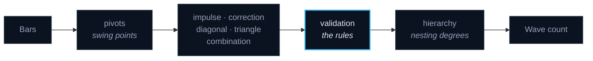

# 🌊 `src/analysis/elliott_wave`

**Wave counting, rebuilt from scratch with the rules made explicit.**

Elliott Wave analysis is usually described in prose and drawn by hand. This package
turns it into code that can be tested: each pattern is a module, each rule is a
predicate, and a count either satisfies them or is rejected.

### How a count is built

`validation` is the module that matters most: without it, a pattern search finds a
"wave count" in any random walk you hand it.

See [ELLIOTT_WAVE_RULES.md](../../../docs/ELLIOTT_WAVE_RULES.md) for the rules
themselves and [ELLIOTT_WAVE_ARCHITECTURE.md](../../../docs/ELLIOTT_WAVE_ARCHITECTURE.md)
for how they are applied.

### Files in this directory

| File | Purpose | Lines |
|---|---|---:|
| [`measurements.py`](measurements.py) | Records the reference's guideline ratios. | 292 |
| [`combination.py`](combination.py) | Double Three (W-X-Y) and Triple Three (W-X-Y-X-Z), reference sections 5.4/5.5. | 263 |
| [`diagonal.py`](diagonal.py) | Leading Diagonal (LD-*) and Ending Diagonal (ED-*), reference sections 3.3/3.4. | 238 |
| [`impulse.py`](impulse.py) | IMP-01 .. | 231 |
| [`validation.py`](validation.py) | Owns the blocked-rule registry (SRS DM-3) and the lifecycle bookkeeping that goes with it. | 204 |
| [`correction.py`](correction.py) | Zigzag (5.1), generic Flat (5.2) and Running Flat (5.2.3). | 194 |
| [`triangle.py`](triangle.py) | Measures Triangle candidates. | 191 |
| [`models.py`](models.py) | Immutable data types shared by every module in this package. | 181 |
| [`pivots.py`](pivots.py) | Elliott-specific pivot detection (SRS §4a). | 154 |
| [`pipeline.py`](pipeline.py) | The one correct call order, and the only module that knows it. | 127 |
| [`hierarchy.py`](hierarchy.py) | Turns scale-tagged pivot lists into the leg windows the structure detectors consume, and answers containment… | 100 |
| [`momentum.py`](momentum.py) | RSI(13) divergence for IMP-06 -- the OQ-04 resolution. | 92 |

---

[⬅ Back to the project README](../../../README.md)
